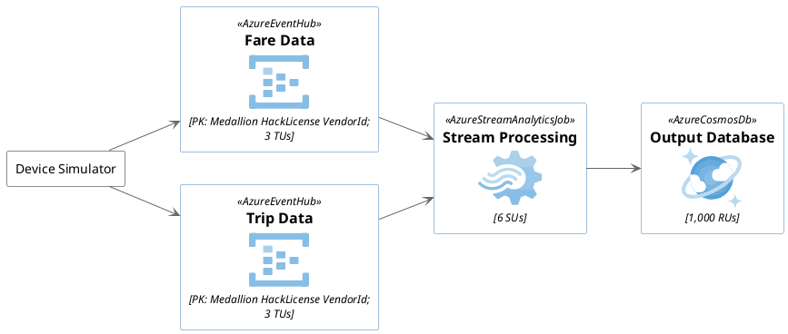
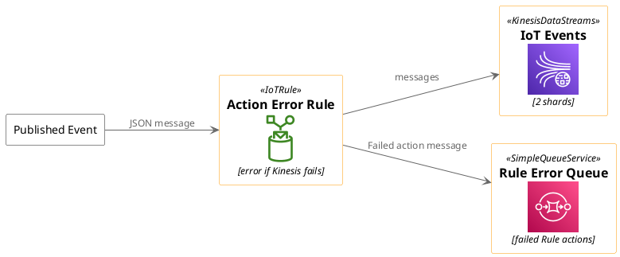
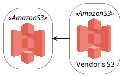
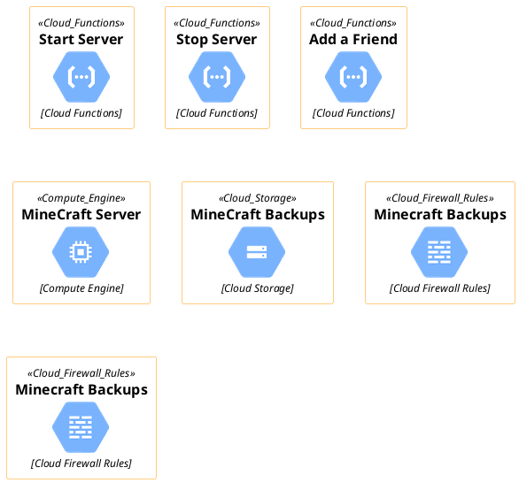
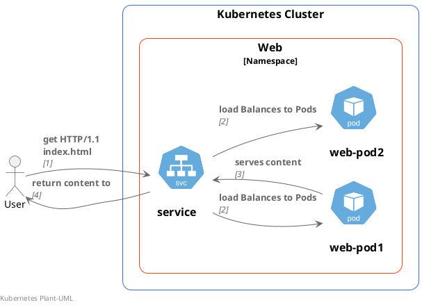
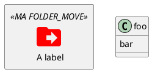
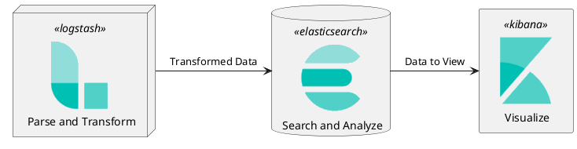

# Cloud

## [Azure](https://plantuml.com/stdlib)



## AWS



## Google



## K8S



## Mix with { }



## Elastic


## Cloudinsight PlantUML sprites

```plantuml
@startuml

!define SPRITESURL https://raw.githubusercontent.com/rabelenda/cicon-plantuml-sprites/v1.0/sprites
!includeurl SPRITESURL/tomcat.puml
!includeurl SPRITESURL/kafka.puml
!includeurl SPRITESURL/java.puml
!includeurl SPRITESURL/cassandra.puml

title Cloudinsight sprites example

skinparam monochrome true

rectangle "<$tomcat>\nwebapp" as webapp
queue "<$kafka>" as kafka
rectangle "<$java>\ndaemon" as daemon
database "<$cassandra>" as cassandra

webapp -> kafka
kafka -> daemon
daemon --> cassandra 

@enduml
```

## Archimate-PlantUML

```plantuml
@startuml
!includeurl https://raw.githubusercontent.com/ebbypeter/Archimate-PlantUML/master/Archimate.puml

title Archimate Sample - Requirement & Application Services

'Elements'
Motivation_Requirement(ReqPayrollStandard, "Do Payroll with a standard system")
Motivation_Requirement(ReqBudgetPlanning, "Do budget planning within the ERP system")

Application_Service(ASPayroll,"Payroll Service")
Application_Service(ASBudgetPlanning,"Budget Planning Service")
Application_Component(ACSAPFinanceAccRec, "SAP Finance - Accounts Recievables")
Application_Component(ACSAPHR, "SAP Human Resources")
Application_Component(ACSAPFin, "SAP Finance")
Application_Component(ACSAP,"SAP") 

'Relationships'
Rel_Realization_Up(ASPayroll, ReqPayrollStandard)
Rel_Realization_Up(ASBudgetPlanning, ReqBudgetPlanning)
Rel_Realization_Up(ACSAPFinanceAccRec, ASBudgetPlanning)
Rel_Realization_Up(ACSAPHR, ASPayroll)

Rel_Composition_Up(ACSAPFin, ACSAPFinanceAccRec)
Rel_Composition_Up(ACSAP, ACSAPHR)
Rel_Composition_Up(ACSAP, ACSAPFin)
@enduml
```

## EIP-PlantUML

```plantuml
rectangle "Business Object" as obj
component [Messaging\nInfrastructure] as infra
MessagingMapper(mapper, "Messaging Mapper") 
obj -- mapper
Send(mapper, infra)
```

## References

1. https://github.com/plantuml/plantuml-stdlib/tree/master
2. https://github.com/milo-minderbinder/AWS-PlantUML
3. https://github.com/awslabs/aws-icons-for-plantuml
4. https://github.com/plantuml-stdlib/Azure-PlantUML
5. https://github.com/awslabs/aws-icons-for-plantuml/blob/main/AWSSymbols.md
6. https://github.com/awslabs/aws-icons-for-plantuml
7. https://github.com/plantuml-stdlib/Azure-PlantUML/blob/master/AzureSymbols.md
8. https://github.com/plantuml-stdlib/plantuml-kubernetes-sprites
9. https://github.com/plantuml-stdlib/EIP-PlantUML
10. https://github.com/plantuml-stdlib/cicon-plantuml-sprites/blob/master/sprites-list.md
11. https://github.com/plantuml-stdlib/cicon-plantuml-sprites
12. 