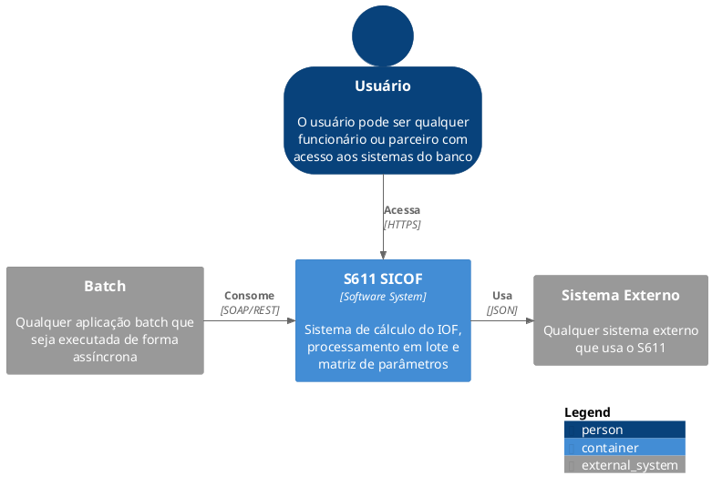
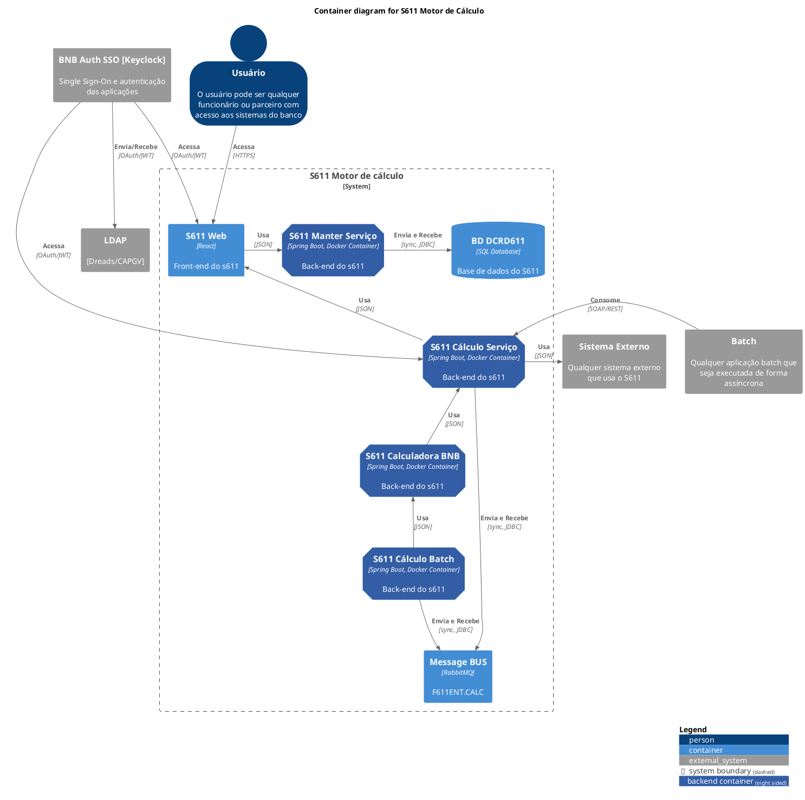
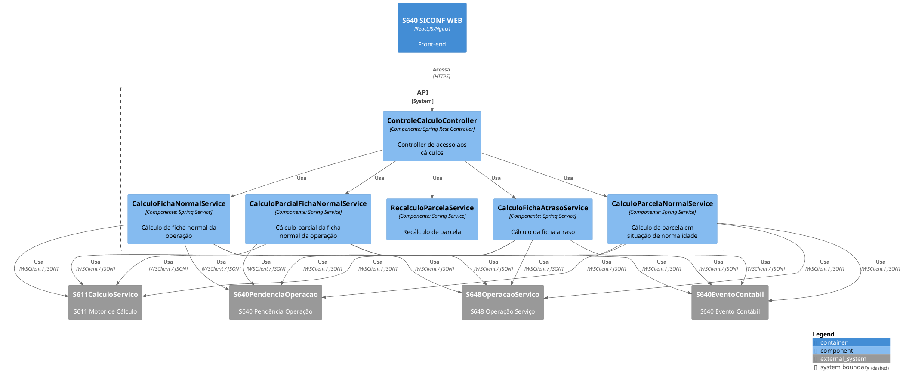
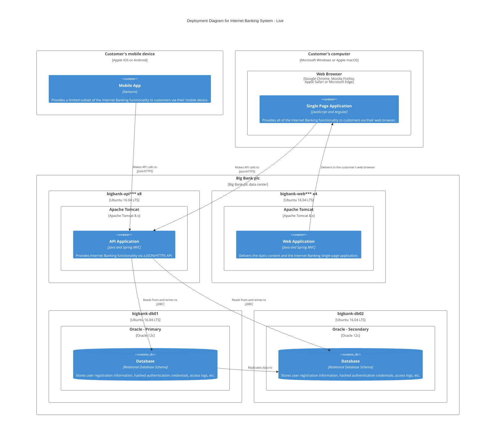

# Diagrams as code - C4 model

## PlantUml

### C1 Level

### C2 Level 2

#### Container 611

#### Container 640

```plantuml
@startuml S640_SICONF_Container
!include <C4/C4_Container.puml>
!include <tupadr3/material/queue>
!include <tupadr3/devicons2/react_original>

SHOW_PERSON_OUTLINE()
AddElementTag("backendContainer", $fontColor=$ELEMENT_FONT_COLOR, $bgColor="#335DA5", $shape=EightSidedShape(), $legendText="backend container\neight sided")
AddRelTag("async", $textColor=$ARROW_COLOR, $lineColor=$ARROW_COLOR, $lineStyle=DashedLine())
AddRelTag("sync/async", $textColor=$ARROW_COLOR, $lineColor=$ARROW_COLOR, $lineStyle=DottedLine())

title Container diagram for S640 SICONF - Sistema de Controle Financeiro e Contábil de Operações de Crédito

Person(usuario, "Usuário", "O usuário pode ser qualquer funcionário ou parceiro com acesso aos sistemas do banco")

System_Boundary(c1, "S640 SICONF - Sistema de Controle Financeiro e Contábil de Operações de Crédito") {
Container(s640web, "S640 SICONF Web", "Container: React/TS", "Front-end", $sprite="react_original")
Container(administrativo, "Administrativo", "Container: Spring Boot", "Back-end", $tags="backendContainer")
Container(dominio, "Domínio", "Spring Boot, Docker Container", "Back-end", $tags="backendContainer")
Container(desembolso, "Desembolso", "Spring Boot, Docker Container", "Back-end", $tags="backendContainer")
Container(controle_restricoes, "Controle Restrições", "Spring Boot, Docker Container", "Back-end", $tags="backendContainer")
Container(ger_lancamentos, "Gerenciador de Lançamentos", "Spring Boot, Docker Container", "Back-end", $tags="backendContainer")
Container(operacao_servico, "Operação Serviço", "Spring Boot, Docker Container", "Back-end", $tags="backendContainer")
Container(ger_pendencias, "Gerenciador Pendências", "Spring Boot, Docker Container", "Back-end", $tags="backendContainer")
Container(transferencia_atraso, "Transferência Atraso", "Spring Boot, Docker Container", "Back-end", $tags="backendContainer")
Container(ger_debito_automatico, "Gerenciador Débito Automático", "Spring Boot, Docker Container", "Back-end", $tags="backendContainer")
Container(calculo_servico, "Cálculo Serviço", "Spring Boot, Docker Container", "Back-end", $tags="backendContainer")
Container(ger_calculo, "Gerenciador Cálculo", "Spring Boot, Docker Container", "Back-end", $tags="backendContainer")
Container(evento_contabil, "Evento Contábil", "Spring Boot, Docker Container", "Back-end", $tags="backendContainer")
Container(ger_prejuizamento, "Gerenciador Prejuizamento", "Spring Boot, Docker Container", "Back-end", $tags="backendContainer")
Container(controle_parcelas, "Controle de Parcelas", "Spring Boot, Docker Container", "Back-end", $tags="backendContainer")
Container(ger_credito_conta, "Gerenciador Crédito Conta", "Container: Spring Boot", "Back-end", $tags="backendContainer")
Container(previsao_liquidacao, "Previsão Liquidação", "Container: Spring Boot", "Back-end", $tags="backendContainer")
Container(renegociacao_servico, "Renegociação Serviço", "Container: Spring Boot", "Back-end", $tags="backendContainer")

ContainerQueue(mq, "IBM MQ ", "Mainframe: IBMMQ", "F611ENT.CALC", $sprite="queue")
ContainerDb(db2, "DB2 DCRD640", "DB2", "Base de dados")
}

System_Ext(auth, "BNB Auth SSO [Keyclock]", "Single Sign-On e autenticação das aplicações" )
System_Ext(ldap, "LDAP", "[Dreads/CAPGV]" )
System_Ext(externo, "Sistema Externo", "Qualquer sistema externo")
System_Ext(batch, "Batch", "Qualquer aplicação batch que seja executada de forma assíncrona")

Rel(usuario, s640web, "Acessa", "HTTPS")

Rel(auth, ldap, "Envia/Recebe", "OAuth/JWT")
Rel(auth, s640web, "Acessa", "OAuth/JWT")
Rel_Neighbor(s640web, administrativo, "Usa", "JSON")
Rel_Neighbor(s640web,dominio, "Usa", "JSON")
Rel(s640web, operacao_servico, "Usa", "JSON")
Rel(s640web, desembolso, "Usa", "JSON")
Rel( desembolso, ger_lancamentos, "Usa", "JSON")
Rel(s640web, ger_lancamentos, "Usa", "JSON")
Rel(s640web, controle_restricoes, "Usa", "JSON")
Rel(s640web, transferencia_atraso, "Usa", "JSON")
Rel(s640web, ger_pendencias, "Usa", "JSON")

Rel(transferencia_atraso, controle_restricoes, "Usa", "JSON")

Rel_Back( evento_contabil, ger_prejuizamento, "Usa", "JSON")
Rel_Back( evento_contabil, transferencia_atraso, "Usa", "JSON")
Rel_Back( evento_contabil, ger_calculo, "Usa", "JSON")
Rel_Back( evento_contabil, calculo_servico, "Usa", "JSON")
Rel_Back( evento_contabil, renegociacao_servico, "Usa", "JSON")
Rel_Back( evento_contabil, controle_parcelas, "Usa", "JSON")

Rel_Back( ger_pendencias, transferencia_atraso, "Usa", "JSON")
Rel_Back( ger_pendencias, operacao_servico, "Usa", "JSON")
Rel_Back( ger_pendencias, desembolso, "Usa", "JSON")
BiRel( ger_pendencias, ger_debito_automatico, "Usa", "JSON")
Rel( ger_pendencias, ger_prejuizamento, "Usa", "JSON")
Rel( ger_pendencias, renegociacao_servico, "Usa", "JSON")
BiRel( ger_pendencias, controle_parcelas, "Usa", "JSON")
BiRel( ger_pendencias, previsao_liquidacao, "Usa", "JSON")

Rel(ger_debito_automatico,ger_lancamentos, "Usa", "JSON")
Rel_Back( ger_debito_automatico, ger_credito_conta, "Usa", "JSON")

SHOW_LEGEND()
@enduml
```

### C3 Level 3

## [Mermaid](https://mermaid.js.org/syntax/c4.html)

## References

1. [cannot-open-url](https://forum.plantuml.net/17086/cannot-open-url)
2. [Mermaid](https://mermaid.js.org/syntax/c4.html)
