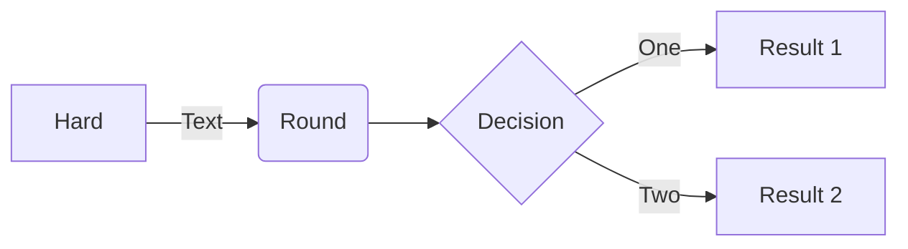
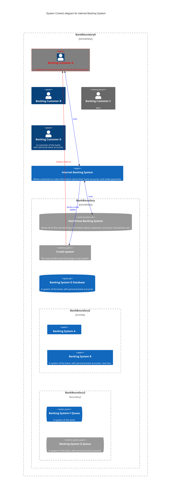
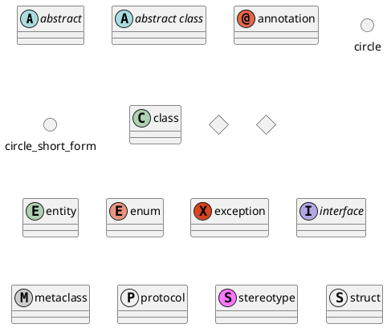

# Diagrams as code

## [Mermaid](https://mermaid.js.org/syntax/c4.html)
Mermaid is a tool that allows you to write diagrams as code and it is easy to set up and integrates with VS Code, markdown and GitHub. 

It works offline and has various diagrams including flow charts, gantt charts, sequence diagrams, class diagrams, git diagrams, and entity relationship diagrams. 

However, it has limited configuration settings and the syntax can be difficult to remember at times.

## PlantUML

> Configurar Extensão PlantUML
> 1. PlantUml: **Render** = Local
> 2. PlantUml: **Server** = https://www.plantuml.com/plantuml

PlantUML is more complex to set up than Mermaid as it requires a server to create diagrams. It offers more configuration settings and supports more types of diagrams than Mermaid, including use case diagrams, activity diagrams, and JSON data visualization. However, it requires sending data over the internet to a server, and the website is outdated.

If you're looking for a tool specifically for creating UML diagrams, PlantUML is a good option. It's a free, open-source tool that allows you to write diagrams using a simple textual language.

## Github docs

[Organizar informações com tabelas](https://docs.github.com/pt/get-started/writing-on-github/working-with-advanced-formatting/organizing-information-with-tables)

## Markdown

[Como usar o Markdown para escrever a documentação](https://experienceleague.adobe.com/docs/contributor/contributor-guide/writing-essentials/markdown.html?lang=pt-BR#:~:text=Para%20formatar%20o%20texto%20como%20it%C3%A1lico%2C%20coloque-o%20entre%20um,text%20is%20**bold**.)

[Markdown tables](https://www.tablesgenerator.com/markdown_tables)

## recommends
Overall, the speaker recommends Mermaid if you are looking for an easy-to-use diagramming tool that integrates with VS Code and markdown. If you need a more extensive diagramming tool with lots of control, then PlantUML is a good choice. Finally, if you have limited diagramming needs and want a really easy-to-use tool, then HackerDraw is worth considering. 

## Python Diagrams [1](https://github.com/mingrammer/diagrams)

Diagrams lets you draw the cloud system architecture in Python code.

## Go-Diagrams [2](https://github.com/blushft/go-diagrams) [3](https://diagrams.mingrammer.com/docs/getting-started/examples)

Go-Diagrams will create a folder in the current working directory with the graphviz DOT file and any image assets.

## References

1. [Mermaid live](https://mermaid.live/)

2. [Mermaid](https://mermaid.js.org/)

3. [Mermaid | Diagramming and charting tool](https://mermaid.live/edit#pako:eNpVjk2Lg0AMhv9KyGkL9Q94WGh1t5fCFurN6SFo7AztfDBGpKj_fcd62c0pvM_zhkzY-JYxx-7px0ZTFKhK5SDNoS50NL1Y6m-QZZ_ziQWsd_ya4fhx8tBrH4Jx993mH1cJium8agyijXssGyre_R_HM5T1mYL4cPtLqtHP8FWbi07n_xMdObW-647yjrKGIhQU3wru0XK0ZNr0_rQmCkWzZYV5WlvuaHiKQuWWpNIg_vpyDeYSB97jEFoSLg3dI9ktXH4B_cJWqw)

4. [Community integrations](https://mermaid.js.org/ecosystem/integrations-community.html)

5. [Include diagrams in your Markdown files with Mermaid](https://github.blog/2022-02-14-include-diagrams-markdown-files-mermaid/)

6. [Diagrams as Code with Mermaid, GitHub, and Visual Studio Code](https://www.youtube.com/watch?v=oiVy7NDm-WM)

7. [Mermaid vs PlantUML vs HackerDraw: Which One Is Best For You?](https://www.youtube.com/watch?v=tPh9_Cx4yZY)

8. [Plantuml](https://www.plantuml.com/)

9. [How to use PlantUML with Markdown](https://gist.github.com/noamtamim/f11982b28602bd7e604c233fbe9d910f)

10. [Markdown Guide](https://www.markdownguide.org/basic-syntax/)