# System Design Components

Mind map diagrams are great for visually representing system design components. Below is a basic example of a system design diagram:

```mermaid
mindmap
  root((System Design))
    1
      Web Server
        Nginx 🌐
        Apache 🏛️
    2 
      API
        REST API 🌐
        MuleSoft 🛠️
        Runscope 🔍
    3 
      Load Balancer
        Nginx 🌐
        Traefik 🧭
    4
      Databases
        MySQL 🐬
        Postgres 🐘
    5
      Full-text Search
        Solr 🌟
    6
      CDN
        Akamai 🚀
        Amazon CloudFront 🌍
    7 
      Distributed Storage System
        Amazon S3 📦
        Hadoop 🐘
    8 
      Monitoring System
        Prometheus 📊
        Kibana 📈
    9 
      Cloud Infrastructure
        AWS ☁️
        Azure ⛅
    10
      Cache
        Redis ⚡
    11 
      Distributed Messaging System
        RabbitMQ 🐇
        Kafka 🌀
    12
      Analytics
        Spark 🔥
```

### Explanation:
- **Web Server**: Handles HTTP requests and serves static and dynamic content.
- **API**: Manages the communication between different parts of the system, typically using REST or GraphQL.
- **Load Balancer**: Distributes incoming traffic across multiple servers to ensure reliability and performance.
- **Databases**: Stores structured data, could include relational (SQL) or NoSQL databases.
- **Full-text Search**: Allows searching large volumes of text efficiently, often implemented with tools like Elasticsearch.
- **CDN**: Distributes static content like images, CSS, and JavaScript across multiple locations for fast access.
- **Distributed Storage System**: Manages storage across multiple locations to ensure data redundancy and accessibility.
- **Monitoring System**: Tracks the performance and health of the system, often including logging and alerting features.
- **Cloud Infrastructure**: Represents the underlying cloud services like AWS, Azure, or Google Cloud that host the system.
- **Cache**: Stores frequently accessed data to reduce latency and load on the main database.
- **Distributed Messaging System**: Manages communication between different parts of the system, often using tools like Kafka or RabbitMQ.
- **Analytics**: Gathers and processes data to provide insights into system usage, performance, and other metrics.

This mind map gives a clear, organized view of the different components that might be part of a modern, scalable system. Each branch can be expanded further depending on the specific needs and complexity of the system you’re designing.