# Master System Design

Using Mermaid's C4 diagram notation, you can represent a system design with the components you mentioned in a more structured way. Here's how you can model it:

```mermaid
C4Context
    title Master System Design

    Container(dns, "DNS", "DNS Service", "Resolves domain names to IP addresses")
    
    Person(client, "Client", "End user interacting with the system")
    
    Container(lb, "Load Balancer", "Load Balancer", "Distributes traffic across servers")

        
    Enterprise_Boundary(eb0, "System Design") {  
            
        System_Boundary(sb1, "Notification layer") {   
            Container(notif1, "Notification", "Notification Service", "Notification Service for asynchronous processing")

            ContainerQueue(notif, "Notification Queue", "Queue Service", "Queues messages for asynchronous processing")
            
            Container(search, "Search Results Aggregators", "Queue Service", "Queues messages for asynchronous processing")

            Boundary(b11, "Databases", "Metadata") {  
                Component(search1, "Search Index", "(ElasticSearch)", "Stores frequently accessed data to reduce database load")
                Component(cache1, "Cache", "Caching Service", "Stores frequently accessed data to reduce database load")
                Component(store1, "Cache", "Caching Service", "Stores frequently accessed data to reduce database load")
            }
        }

        System_Boundary(sb2, "APP Server Read", "") {  
            
            Container(api1, "API Gateway", "API Gateway", "Manages and routes API requests")
            
            Container(app1, "App Server", "READ", "Handles business logic and processes requests")
            
            Container(cache, "Cache Service", "Redis/Memcached", "Stores frequently accessed data to reduce database load")
            
            Component(directory, "Directory based partitioning", "Caching Service", "Stores frequently accessed data to reduce database load")
            
            Component(shard, "Shard Manager", "Caching Service", "Stores frequently accessed data to reduce database load")
            
            Boundary(b21, "Databases", "Metadata") {  
              SystemDb(db1, "Metadata", "Database", "Stores persistent data")
              ContainerDb(db2, "Metadata", "Database", "Stores persistent data")
            }
        }

        System_Boundary(sb3, "APP Server Write", "") {  
            
            Container(api2, "API Gateway", "API Gateway", "Manages and routes API requests")
            
            Container(app2, "App Server", "WRITE", "Handles business logic and processes requests")
            
            ContainerQueue(video, "Video Processing Queue", "Queue Service", "Queues messages for asynchronous processing") 
            
            ContainerQueue(feed, "Feed Video Processing Queue", "Queue Service", "Queues messages for asynchronous processing") 
            
            Component(feed1, "Feeds", "Feed Service", "Processes tasks from the queue")
        }

        System_Boundary(sb4, "Static Content layer", "") {   
            
            Container(cdn, "CDN", "Content Delivery Network", "Serves static content to clients") 
            
            Container(file, "Distributed File Storage", "(Video, Image/Thumbnail)", "Queues messages for asynchronous processing") 
            
            Container(image, "Video/Image Processing Service", "Processing Service", "Queues messages for asynchronous processing")
            Boundary(b41, "Workers") {  
              
              Component(workers1, "Workers", "Worker Servers", "Processes tasks from the queue")
              
              Component(workers2, "Workers", "Worker Servers", "Processes tasks from the queue")
              
              Component(workers3, "Workers", "Worker Servers", "Processes tasks from the queue")
            }
        }

        System_Boundary(sb5, "Observability layer") {
            Container(coord, "Coordination Service", "Zookeeper", "Serves static content to clients") 
            Container(log, "Distributed Logging", "log", "Serves static content to clients") 
            Container(trace, "Distributed Tracing", "tracing", "Serves static content to clients") 
        }  
        System_Boundary(sb6, "Data Warehouse layer") {
            Container(data, "Data Processing Systems", "Hadoop, MapReduce, Spark", "Serves static content to clients")
            Container(scheduler, "Distributed Scheduler", "", "Serves static content to clients")
            Component(workers4, "Workers", "Worker Servers", "Processes tasks from the queue")
        }
        System_Boundary(sb7, "Reports layer") {
            Container(reports, "Reports Viewing & Data analysis", "Processes task to generate reports and views", "")
            ContainerDb(db3, "Metadata", "Database", "Stores persistent data")
        }
    }


    BiRel(client, dns, "Resolves domain name")
    Rel(cdn, client, "Serves static content")
    Rel(file, cdn,  "Serves static content")
    BiRel(file, image,  "Serves static content")
    BiRel(image, workers1, "Serves static content")
    Rel(client, lb, "Routes traffic")
    Rel(notif, notif1, "Notification Queue")
    Rel(notif1, client, "Notification Service")
    Rel(lb, api1, "Routes requests to API Gateway")
    Rel(lb, api2, "Routes requests to API Gateway")
    BiRel(api1, app1, "Sends requests to App Server")
    BiRel(api2, app2, "Sends requests to App Server")
    BiRel(app1, cache, "Checks/updates cache")
    BiRel(cache, db1, "Replication and Partitioning")
    Rel(app1, notif, "Enqueues tasks")
    Rel(app1, search, "Enqueues tasks")
    BiRel(search, search1, "Enqueues tasks")
    Rel(app2, video, "Video processing task")
    Rel(video, image, "Enqueues tasks")
    Rel(app2, feed, "Feed Generation task")
    Rel(feed, feed1, "Enqueues tasks")
    Rel(feed1, db2, "Enqueues tasks")
    Rel(cache, directory, "Enqueues tasks")
    Rel(shard, directory, "Enqueues tasks")
    Rel(shard, db1, "Enqueues tasks")
    Rel(data, db2, "Enqueues tasks")
    Rel(data, db3, "Output (Metrics, Reports, etc)")
    Rel(db3, reports, "Enqueues tasks")

    UpdateElementStyle(lb, $fontColor="white", $bgColor="green", $borderColor="yellow")
    UpdateElementStyle(db1, $fontColor="black", $bgColor="grey", $borderColor="black")
    UpdateElementStyle(db2, $fontColor="black", $bgColor="grey", $borderColor="black")
    UpdateElementStyle(workers1, $fontColor="white", $bgColor="red", $borderColor="black")
    UpdateElementStyle(workers2, $fontColor="white", $bgColor="red", $borderColor="black")
    UpdateElementStyle(workers3, $fontColor="white", $bgColor="red", $borderColor="black")
    UpdateElementStyle(workers4, $fontColor="white", $bgColor="red", $borderColor="black")
    UpdateElementStyle(feed1, $fontColor="white", $bgColor="red", $borderColor="black")
    UpdateElementStyle(search, $fontColor="white", $bgColor="orange", $borderColor="black")
    UpdateElementStyle(image, $fontColor="white", $bgColor="orange", $borderColor="black")
    UpdateElementStyle(api1, $fontColor="white", $bgColor="purple", $borderColor="black")
    UpdateElementStyle(api2, $fontColor="white", $bgColor="purple", $borderColor="black")
    UpdateElementStyle(notif, $fontColor="white", $bgColor="black", $borderColor="red")
    UpdateElementStyle(video, $fontColor="white", $bgColor="black", $borderColor="red")
    UpdateElementStyle(feed, $fontColor="white", $bgColor="black", $borderColor="red")

    UpdateLayoutConfig($c4ShapeInRow="2", $c4BoundaryInRow="4")
    
```

### Explanation:
1. **Person (Client)**: Represents the end user interacting with the system.
2. **DNS**: Resolves the domain name to the appropriate IP address.
3. **CDN**: Serves static content to clients, reducing load on the servers.
4. **Load Balancer**: Distributes incoming traffic across different servers to ensure availability and reliability.
5. **API Gateway**: Manages and routes API requests to the appropriate App Server.
6. **App Server**: Handles the business logic of the application, processing requests from users or services, and interacting with both the Cache and Databases to retrieve or store data. The App Server first interacts with the Cache to see if the required data is available. If not, it communicates with the Shard Manager to determine which Database shard to query, based on the partitioning logic (e.g., Directory-Based Partitioning).
- **Cache**: stores frequently accessed data in memory, reducing the need to repeatedly query the database for the same information. This speeds up data retrieval and reduces the load on the underlying databases. The App Server checks the Cache before querying the Databases. If the data is found in the cache (a cache hit), it’s returned immediately, bypassing the need for a database query. If not (a cache miss), the App Server queries the Database, and the result may be stored in the cache for future use.
- **Shard Manager**: is responsible for determining how data is divided (sharded) across multiple databases or storage nodes. It keeps track of which shard stores which piece of data and directs requests accordingly. The Shard Manager works closely with the App Server to route data requests to the correct shard. It ensures that each request is efficiently directed to the appropriate Database partition.
- **Directory-Based Partitioning** : is a method of sharding where a directory (or lookup table) maps data to specific shards. This directory tells the Shard Manager where each piece of data resides. The Shard Manager uses the directory to determine which Database shard stores a particular piece of data. The App Server then uses this information to route queries to the correct shard, ensuring efficient data retrieval and storage.
- **Database**: Store the persistent data for the system. In a sharded environment, each database shard holds a subset of the total data, divided based on some key (like a user ID).The Databases are partitioned and managed by the Shard Manager, which determines which shard handles each piece of data. The App Server interacts with the appropriate Database shard based on instructions from the Shard Manager. The Cache helps reduce direct interactions with the Databases, improving performance.
- **Notification Queue**: Manages asynchronous tasks, queuing messages for background processing.
- **Workers**: Processes tasks from the Notification Queue, such as sending emails or performing background jobs.

When designing a distributed system, there are several strategies for splitting an application server into different components, each with its own advantages and use cases. The best choice depends on the specific requirements, performance characteristics, and scalability needs of your application. Here are some additional strategies, along with a comparison of when each approach might be the best choice:

## split the application server into two servers, metadata server and block server

Splitting the application server into two separate servers—a **Metadata Server** and a **Block Server**—is a design pattern often used in distributed storage systems, large-scale file systems, or database systems. This separation brings several advantages in terms of performance, scalability, and manageability. Here’s why it’s beneficial:

### 1. **Separation of Concerns**
   - **Metadata Server**: Handles all operations related to metadata, such as file names, permissions, directories, and other organizational data. It doesn’t store the actual content but rather information about the content.
   - **Block Server**: Manages the actual data blocks or the content itself, storing the raw data that is referenced by the metadata.
   - **Benefit**: By separating these responsibilities, each server can be optimized for its specific tasks. The Metadata Server can focus on efficiently managing and querying metadata, while the Block Server can optimize for high-throughput data storage and retrieval.

### 2. **Performance and Scalability**
   - **Metadata Server**: Since metadata operations (like lookups, updates, and directory management) are typically small and frequent, they can be handled very quickly. The Metadata Server can be scaled horizontally or vertically to manage large volumes of metadata queries without being bogged down by data-heavy operations.
   - **Block Server**: The Block Server, on the other hand, can be optimized for large data transfers, focusing on disk I/O, throughput, and storage capacity. It can handle large files or data blocks efficiently without needing to manage metadata.
   - **Benefit**: This separation allows each type of server to scale independently. For example, as your system grows, you might need more Block Servers to handle increased data volume but may not need to scale the Metadata Server as much.

### 3. **Improved Fault Tolerance and Reliability**
   - **Metadata Server**: If metadata and data blocks were managed by the same server, a failure could result in both metadata and data being unavailable. By separating them, you reduce the risk of a single point of failure.
   - **Block Server**: Similarly, if a Block Server fails, the metadata remains intact, allowing for easier data recovery and reduced impact on the overall system.
   - **Benefit**: The separation enhances the system’s reliability and makes it easier to implement fault tolerance mechanisms, such as replication or data recovery strategies, for each type of server.

### 4. **Efficiency in Data Distribution and Access**
   - **Metadata Server**: Can be designed to quickly direct clients to the correct Block Server that holds the required data. It handles requests like "Where is this file stored?" without needing to deal with the actual data transfer.
   - **Block Server**: Once directed, clients interact directly with the Block Server to read or write data, bypassing the Metadata Server and reducing its load.
   - **Benefit**: This approach reduces the bottleneck on the Metadata Server and allows clients to access data more efficiently.

### 5. **Flexibility in System Design**
   - **Metadata Server**: By abstracting metadata management, the system can support various types of storage backends or block servers, making the overall architecture more flexible.
   - **Block Server**: Can be tailored to different storage technologies (e.g., SSDs, HDDs, distributed file systems) without affecting the metadata management layer.
   - **Benefit**: This modular approach allows the system to adapt to different use cases, storage requirements, or even infrastructure changes without major overhauls.

### Summary
Splitting an application server into a **Metadata Server** and a **Block Server** allows for a more scalable, efficient, and reliable system. The Metadata Server can handle frequent, lightweight metadata operations, while the Block Server manages heavy data transfers and storage. This separation of concerns improves performance, fault tolerance, and flexibility, making it an effective design choice for large-scale, distributed systems.

## split the application server into two servers, write server and read server

Splitting the application server into two separate servers—a **Write Server** and a **Read Server**—is a design pattern often used to optimize performance and scalability in systems with distinct read and write workloads. This approach is particularly useful in environments where the read and write operations have different performance requirements or where the read-to-write ratio is highly skewed. Here’s why this split can be beneficial:

### 1. **Optimized Performance**
   - **Write Server**: Dedicated to handling all write operations, such as creating, updating, or deleting data. The Write Server can be optimized for tasks like ensuring data consistency, managing transactions, and handling write-heavy workloads.
   - **Read Server**: Handles all read operations, retrieving data for clients or other services. The Read Server can be optimized for quick data retrieval, caching, and read-heavy workloads.
   - **Benefit**: By separating these tasks, each server can be fine-tuned for its specific operations, leading to better overall performance. The Write Server can focus on maintaining data integrity and consistency, while the Read Server can be optimized for fast data access.

### 2. **Scalability**
   - **Write Server**: In systems with high write demands, the Write Server can be scaled independently to handle the load. For example, if your application experiences frequent data updates, the Write Server can be replicated or enhanced with better hardware.
   - **Read Server**: Since many applications have a higher read-to-write ratio, the Read Server can be scaled out (e.g., through replication or load balancing) to handle many more read requests. This is especially useful in read-heavy applications like content delivery platforms or analytics systems.
   - **Benefit**: This separation allows the system to scale efficiently based on the specific needs of read or write operations. You can add more Read Servers as the number of users or queries increases without affecting the Write Server.

### 3. **Improved Data Consistency and Availability**
   - **Write Server**: By isolating write operations, the Write Server can enforce stricter consistency models, such as strong consistency or transactional integrity, without being affected by the read load.
   - **Read Server**: The Read Server can use eventual consistency or replicate data asynchronously from the Write Server. This allows read operations to be highly available and responsive, even if there is a slight delay in data propagation from the Write Server.
   - **Benefit**: This separation enhances both consistency and availability. The Write Server ensures that all writes are consistent, while the Read Server provides high availability for read operations, even during peak loads.

### 4. **Fault Tolerance and Reliability**
   - **Write Server**: If the Write Server fails, write operations may be temporarily disrupted, but read operations can continue unaffected. You can implement replication or failover mechanisms to recover write functionality quickly.
   - **Read Server**: In the event of a Read Server failure, other read servers can continue serving data, minimizing the impact on the system. Since the Read Server typically works with replicas, read operations can continue even if the primary Write Server is down.
   - **Benefit**: The system becomes more fault-tolerant, with read and write operations isolated from each other. Failures in one server type do not necessarily impact the other, allowing for more resilient system design.

### 5. **Load Balancing and Traffic Management**
   - **Write Server**: The Write Server handles a more controlled and typically lower volume of traffic (since writes are often less frequent than reads), making it easier to manage and balance the load.
   - **Read Server**: The Read Server can be distributed across multiple instances to balance the load of high traffic. Techniques like read replicas or caching can be used to distribute read traffic effectively.
   - **Benefit**: This separation allows for more efficient traffic management, ensuring that neither read nor write operations overwhelm the system. Load balancers can be used to direct traffic appropriately, optimizing resource utilization.

### 6. **Application-Specific Optimization**
   - **Write Server**: The Write Server can be optimized for write-heavy operations, such as bulk data inserts, transactional integrity, or distributed writes in a multi-node environment.
   - **Read Server**: The Read Server can implement strategies like aggressive caching, query optimization, or even different storage backends optimized for fast reads.
   - **Benefit**: Each server can be tailored to the specific needs of its operation, allowing for better resource utilization and performance tuning.

### Summary
Splitting the application server into a **Write Server** and a **Read Server** allows for more efficient handling of read and write operations. The Write Server can focus on maintaining data integrity and handling write-heavy operations, while the Read Server can be optimized for fast data retrieval and high availability. This separation enhances performance, scalability, fault tolerance, and overall system efficiency, especially in applications with distinct and heavy read/write workloads.

## Are there any other strategies? Which one is the best choice?

### 1. **Frontend and Backend Servers**
   - **Frontend Server**: Handles user-facing components like UI rendering, client requests, and routing.
   - **Backend Server**: Manages business logic, data processing, and interactions with databases or other services.
   - **Use Case**: Common in web applications where the UI and backend logic need to scale independently. Frontend servers can handle high traffic, while backend servers focus on processing data and executing business logic.
   - **Best For**: Applications with heavy user interaction, where the frontend needs to be highly responsive and the backend needs to handle complex business rules.

### 2. **Microservices Architecture**
   - **Microservices**: Break down the application into small, independent services, each responsible for a specific business function (e.g., user management, payment processing).
   - **Use Case**: Large, complex applications that require high modularity, scalability, and independent deployment of components.
   - **Best For**: Applications needing to scale specific features independently, or where different teams work on separate parts of the system.

### 3. **Stateless and Stateful Servers**
   - **Stateless Server**: Handles requests without storing any session data between requests, allowing easy horizontal scaling.
   - **Stateful Server**: Maintains session state across requests, necessary for tasks like user authentication or real-time communication.
   - **Use Case**: Applications with varying needs for session management. Stateless servers are ideal for scalable web services, while stateful servers are needed for components like authentication servers.
   - **Best For**: Systems that need to balance scalability with the need to maintain stateful interactions.

### 4. **Task-Based Servers**
   - **Compute Server**: Handles CPU-intensive tasks like data processing, analytics, or machine learning inference.
   - **I/O Server**: Manages I/O-bound tasks like database interactions, file storage, or network communication.
   - **Use Case**: Applications that need to optimize for different types of workloads. Compute servers can be optimized for high-performance processing, while I/O servers focus on handling data input/output efficiently.
   - **Best For**: Systems with distinct processing and I/O needs, where separating these tasks can improve overall performance.

### 5. **Transaction and Query Servers**
   - **Transaction Server**: Manages all transactional operations, ensuring ACID properties and data integrity during writes.
   - **Query Server**: Handles read-only queries, optimized for fast data retrieval without needing to manage transactional integrity.
   - **Use Case**: Databases or systems with heavy transactional workloads but also a need for fast, read-only access to data.
   - **Best For**: Systems where transactional and query operations have different performance characteristics and need to be optimized separately.

### **Comparison and Best Choice**

#### **1. Write Server and Read Server**
   - **Strengths**: Optimizes for systems with distinct read/write workloads. Allows independent scaling and optimization of read and write operations.
   - **Weaknesses**: Can introduce complexity in ensuring consistency between write and read paths. Potentially increased latency if read and write servers are not synchronized efficiently.
   - **Best For**: Applications with a high read-to-write ratio or where read and write operations have different performance requirements.

#### **2. Metadata Server and Block Server**
   - **Strengths**: Separates data organization from data storage, optimizing for large-scale storage systems or distributed file systems. Improves scalability and fault tolerance.
   - **Weaknesses**: Complexity in managing metadata and ensuring consistency across distributed block servers. Typically used in specialized systems like distributed file systems.
   - **Best For**: Systems that handle large volumes of data, where the metadata and actual data require different handling, such as in cloud storage services or distributed databases.

#### **3. Frontend and Backend Servers**
   - **Strengths**: Clear separation of user interface from business logic. Easy to scale the frontend independently based on user demand.
   - **Weaknesses**: Requires well-defined APIs between frontend and backend, which can add complexity. Latency between frontend and backend can be an issue if not managed properly.
   - **Best For**: Web applications or services with distinct user interface and business logic layers.

#### **4. Microservices Architecture**
   - **Strengths**: Highly modular and scalable. Allows independent development and deployment of services. Facilitates continuous delivery and integration.
   - **Weaknesses**: Complexity in managing communication between services, potential overhead from network calls, and need for service discovery and management.
   - **Best For**: Large, complex applications with teams working on different parts, requiring independent scalability and flexibility.

#### **5. Stateless and Stateful Servers**
   - **Strengths**: Stateless servers are highly scalable, and stateful servers are essential for maintaining session state.
   - **Weaknesses**: Stateful servers can be harder to scale horizontally, and maintaining state across multiple instances can be challenging.
   - **Best For**: Applications that need to scale stateless components rapidly, but also require stateful interactions for certain features.

#### **6. Task-Based Servers**
   - **Strengths**: Optimizes for different workloads, ensuring that compute-heavy tasks don’t interfere with I/O-bound operations.
   - **Weaknesses**: Requires careful task allocation and management to ensure efficiency. May introduce additional complexity in scheduling and resource allocation.
   - **Best For**: Systems with a clear distinction between processing and I/O tasks, such as analytics platforms or data processing pipelines.

### **Which Strategy is the Best Choice?**
- **Write Server and Read Server**: Best for systems with a clear distinction between read and write operations, especially when there is a high read-to-write ratio.
- **Metadata Server and Block Server**: Best for distributed storage systems or file systems where data organization and storage need to be optimized separately.
- **Frontend and Backend Servers**: Best for web applications with distinct user interface and backend processing needs.
- **Microservices Architecture**: Best for large, complex applications requiring modularity, independent scalability, and flexibility.
- **Stateless and Stateful Servers**: Best for systems that need to scale stateless components rapidly while maintaining stateful interactions.
- **Task-Based Servers**: Best for applications with distinct compute and I/O tasks that require optimization.

The **best choice** ultimately depends on your application's specific needs:
- **For web applications** with a high volume of user interactions and data reads, a **Write Server and Read Server** split may be ideal.
- **For distributed storage systems** or scenarios where data needs to be handled differently based on its type, a **Metadata Server and Block Server** split might be the best approach.
- **For highly modular and complex systems**, a **Microservices Architecture** might be the most effective.

Understanding the workload, scalability requirements, and performance goals of your application will guide you toward the most appropriate strategy.