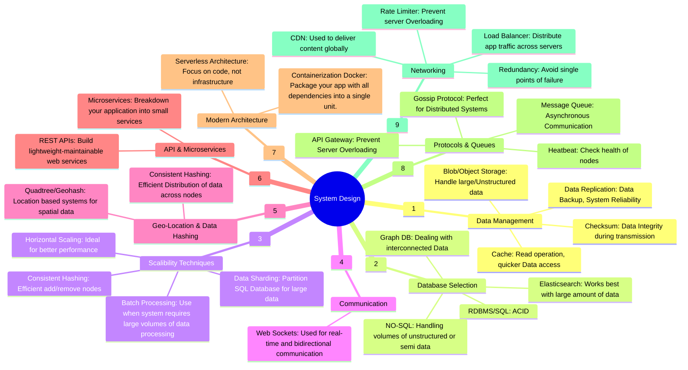
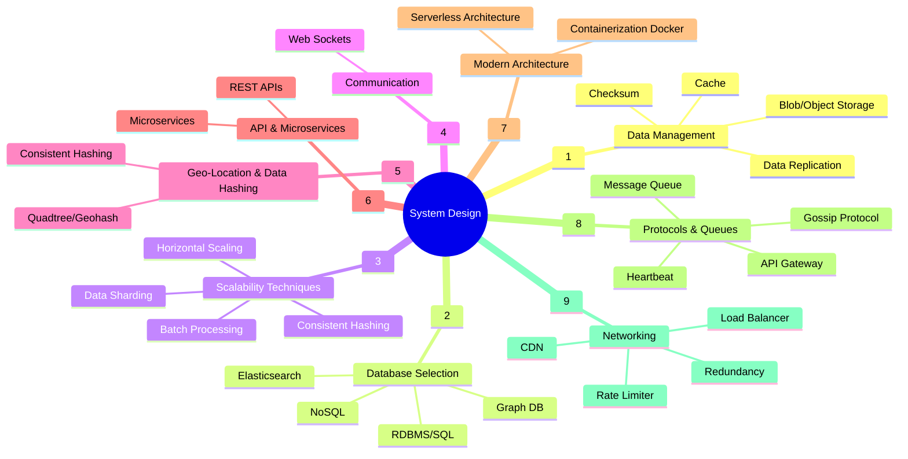

# System Design Interview

Your mind map outlines key components and considerations in system design, organizing them into categories such as data management, database selection, scalability techniques, communication, and more. Here's the structure you provided, formatted into a Mermaid diagram:

## Full version

## Resume Version

### Breakdown of Categories:
1. **Data Management**: Techniques for efficient data storage, retrieval, and consistency.
   1. Cache: Read operation, quicker data access
   2. Blob/Object Storage: Handle large/unstructured data
   3. Checksum: Data integrity during transmission
   4. Data Replication: Data backup, system reliability
2. **Database Selection**: Choosing the right database based on data types and needs.
   1. RDBMS/SQL: ACID
   2. NO-SQL: Handling volumes of unstructured or semi data
   3. Graph DB: Dealing with interconnected Data
   4. Elasticsearch: Works best with large amount of data
3. **Scalability Techniques**: Methods to ensure the system can handle growing amounts of work.
   1. Data Sharding: Partition SQL database for large data
   2. Horizontal Scaling: Ideal for better performance
   3. Consistent Hashing: Efficient add/remove nodes
   4. Batch Processing: Use when system requires large volumes of data processing
4. **Communication**: Tools for real-time and reliable communication within the system.
   1. Web Sockets: Used for real-time and bidirectional communication
5. **Geo-Location & Data Hashing**: Techniques for managing spatial data and distributing data efficiently.
   1. Quadtree/Geohash: Location-based systems for spatial data
   2. Consistent Hashing: Efficient distribution of data across nodes
6. **API & Microservices**: Strategies for creating and managing scalable web services.
   1. REST APIs: Build lightweight, maintainable web services
   2. Microservices: Breakdown your application into small services
7. **Modern Architecture**: Approaches for deploying and managing applications efficiently.
   1. Containerization Docker: Package your app with all dependencies into a single unit
   2. Serverless Architecture: Focus on code, not infrastructure
8. **Protocols & Queues**: Systems for managing communication, workload distribution, and system health.
   1. Message Queue: Asynchronous communication
   2. Gossip Protocol: Perfect for distributed systems
   3. API Gateway: Prevent server overloading
   4. Heartbeat: Check health of nodes
9.  **Networking**: Ensuring efficient, reliable, and global delivery of content and services.
    1.  CDN: Used to deliver content globally
    2.  Load Balancer: Distribute app traffic across servers
    3.  Rate Limiter: Prevent server overloading
    4.  Redundancy: Avoid single points of failure

This mind map helps in visualizing the different aspects of system design, from data management to networking, and provides a comprehensive overview for planning and implementing robust systems.