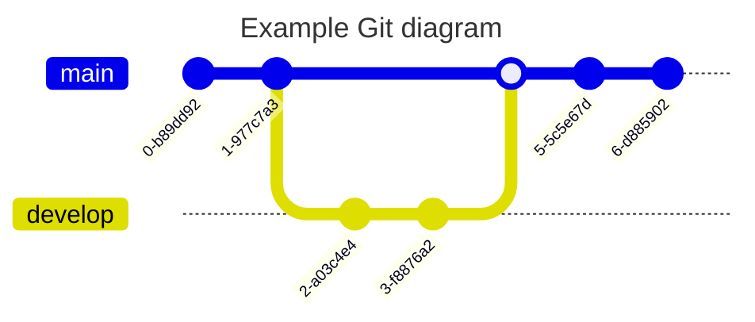

# Branching strategies in git

## Trunk-based Development
The best branching strategy is trunk-based development. In this strategy, developers work on a single branch, the main line. Whenever a feature is complete, it is pushed directly to the main line. This strategy requires a high degree of trust in the quality of the code, as any bugs pushed to the main line will be immediately visible to users.

1. Single branch (Mainline)
2. High team maturity
3. Feature toggles
4. Continuous deployment

## feature branching or GitHub Flow
Another option is feature branching. In this strategy, developers create a new branch for each feature they are working on. Once a feature is complete, the branch is merged back into the main line. This strategy is a good option for small teams working on small applications.

1. One branch per feature
2. Short delivery cycles
3. Continuos delivery
4. Pull requests

## Forking strategy
forking strategy is similar to feature branching but it is specifically used in the context of open source projects. In forking strategy, instead of creating a branch from the main line, you create a copy of the entire repository. You can then work on the features you want to contribute in your own repository and create a pull request to the original project when you are finished. This is because the maintainers of the original project typically don't want to give everyone write access to the main repository.  Forking strategy is the most common way to contribute to open source projects.
1. Forking repositories
2. Mostly open-source

## Release branching
Release branching is a strategy that is often used by teams that need to maintain backwards compatibility. In this strategy, a new branch is created for each release. This branch is then merged back into the main line. Hotfixes can then be applied to all of the release branches.

1. One branch per feature
2. Low frequency deployments
3. No continuous integration
4. Support for previous releases

## Git Flow  
Git flow is a complex branching strategy that is not recommended.
In Git flow, there are multiple branches for development, features, releases, and hotfixes. This strategy can be difficult to manage and can lead to merge conflicts.

1. Branches, branches, and more branches

## Environment branching
environment branching is the most complex branching strategy. It involves creating a separate branch for each deployment environment (e.g., development, staging, production). This allows developers to test changes in a controlled environment before deploying them to production.

It not recommend environment branching due to its complexity. Here are some of the challenges mentioned in the video:

* Complexity: Managing multiple branches for different environments can be complex and prone to errors.
* Merge Conflicts: Merging code between branches can lead to conflicts that need to be resolved.
* Overhead: Keeping all environment branches in sync can require significant effort.

1. Environment branches on top of all others

## Which strategy should you use?

It recommends using trunk-based development or feature branching for most teams. Trunk-based development is the simplest strategy, but it requires strong testing practices. Feature branching is a good option for teams that need to isolate their work. These strategies are generally simpler to manage than environment branching. 

Here is a table that summarizes the different branching strategies discussed in the video:

| Strategy | Description | Best for |
|---|---|---|
| Trunk-based development | Developers work on a single branch, the main line. | Teams with a high degree of trust in the quality of their code |
| Feature branching | Developers create a new branch for each feature they are working on. | Small teams working on small applications |
| Release branching | A new branch is created for each release. | Teams that need to maintain backwards compatibility |
| Git flow | A complex strategy that is not recommended for most teams. |  |
| Environment branching | An even more complex strategy that is not recommended for most teams. |  |

## References

1. [Branching Strategies Explained](https://www.youtube.com/watch?v=U_IFGpJDbeU)
2. [GitGraph Mermaid](https://mermaid.js.org/syntax/gitgraph.html)