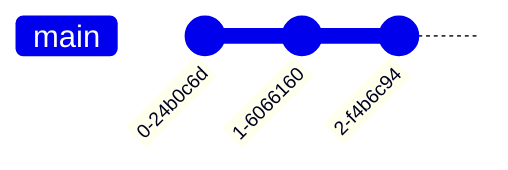
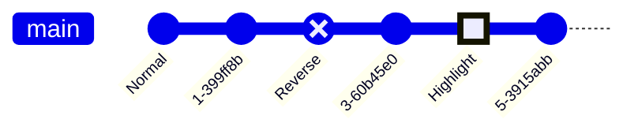
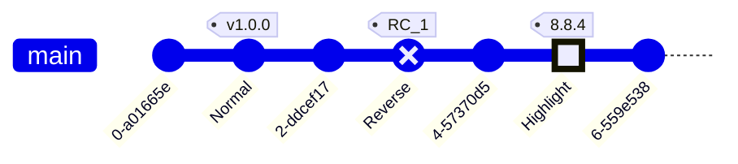
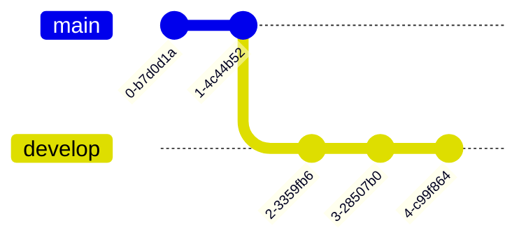
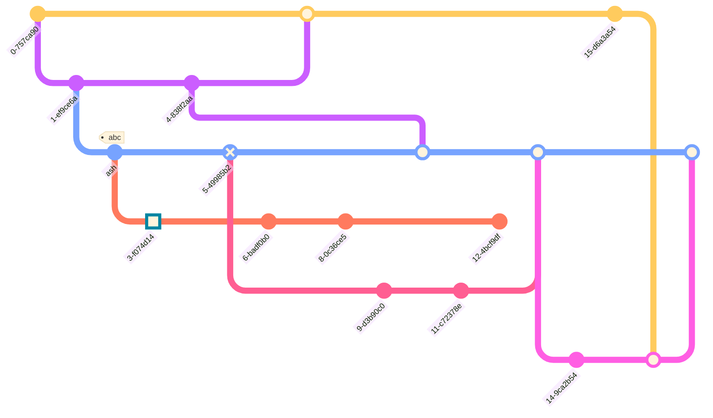

# GitGraph Diagrams

## Table of Contents

- [GitGraph Diagrams](#gitgraph-diagrams)
  - [Table of Contents](#table-of-contents)
  - [GitGraph Diagrams](#gitgraph-diagrams-1)
    - [Basic git operations](#basic-git-operations)
    - [Adding custom commit id](#adding-custom-commit-id)
    - [Modifying commit type](#modifying-commit-type)
    - [Adding Tags](#adding-tags)
    - [Create a new branch](#create-a-new-branch)
    - [Checking out an existing branch](#checking-out-an-existing-branch)
    - [Merging two branches](#merging-two-branches)
    - [Cherry Pick commit from another branch](#cherry-pick-commit-from-another-branch)
    - [Hiding Branch names and lines](#hiding-branch-names-and-lines)
  - [Real case](#real-case)
  - [References](#references)

## GitGraph Diagrams

### Basic git operations


### Adding custom commit id




### Modifying commit type



### Adding Tags



### Create a new branch



### Checking out an existing branch


### Merging two branches


### Cherry Pick commit from another branch


### Hiding Branch names and lines



## Real case


```mermaid

```


## References
1. https://mermaid.js.org/syntax/gitgraph.html