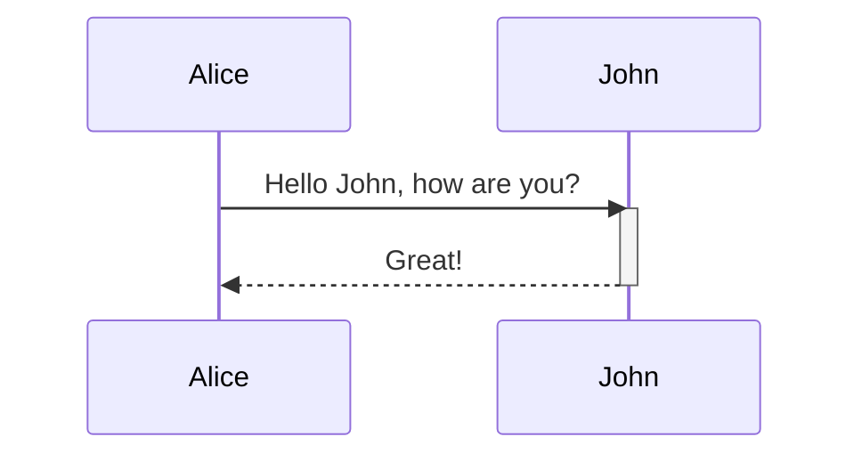

## Descripción del Pedido
Mejoras en la Funcionalidad de Migración/Cambio de Plan para la Fecha Original del Plan: Esta épica abarca mejoras en la funcionalidad de cambio de plan para asegurar que la fecha original del plan se considere con precisión durante los cambios de plan, en lugar de usar la fecha actual.

[Documentación](URL)
[Diagramas de Solución](URL)

## Entregables
- [ ] BNSOW
- [ ] Estimación
- [ ] Diseño Técnico/LLD

## Pendências

| ID | Descripción | Data Apertura | Data Cierre |
| ------ | ------ | ------ | ------ |
| _id da pendência_ | _descrição da pendência_ | _AAAA/MM/DD_ | _AAAA/MM/DD_ |

## Clarificaciones de Diseño
- 
- 
- 

## Flujos del Pedido

### Links
- link1
- link2
- link3

### Flujos

/label ~"Epic"
