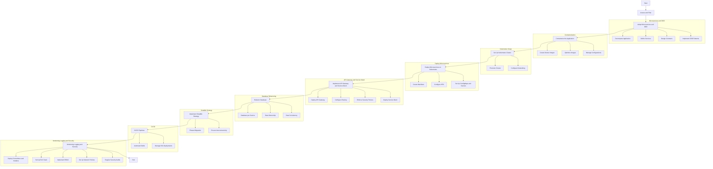

# Kubernetes

That's a creative and relatable way to explain Kubernetes and its components using a restaurant analogy! It helps demystify the concepts for those who may not be familiar with container orchestration. Here's a summary of the analogy:

1. **Kubernetes Cluster** is like the restaurant itself, where everything happens.

2. **Nodes** represent the kitchen and waitstaff combined, with worker nodes as chefs and master nodes as the head chef ensuring smooth operation.

3. **Containers** are likened to plates of food, containing all the ingredients needed to run an application.

4. **Pods** are compared to plates with cutlery, capable of holding multiple containers and sharing network space.

5. **Deployments** serve as the menu, specifying what dishes (containers) are available, how many, and how they should be served.

6. **Services** act as the waitstaff, routing requests to the right pods based on labels and selectors.

7. **ConfigMaps and Secrets** are the recipe book, storing configuration data and sensitive information separately from the application code.

8. **Ingress Controllers** function as the menu display outside the restaurant, directing external requests to the right services.

9. **Persistent Storage** is like the fridge and pantry, where important data is stored, persisting even if a container is replaced.

This analogy can make it easier for people to understand the fundamental components and concepts of Kubernetes, making it more accessible and relatable.

## Best Way to Understand Kubernates Architectyre

Kubernetes is an open-source container orchestration platform that automates the deployment, scaling, and management of containerized applications, allowing for seamless and efficient container orchestration in a cluster of machines.


Let's break it down using a familiar scenario: a restaurant!


Kubernetes Cluster: The Restaurant

- Think of the cluster as the restaurant itself – where everything happens. It's the place with tables, chairs, and a bustling kitchen.

Nodes: The Kitchen and Waitstaff

- Nodes are like the kitchen and the waitstaff combined. They run the show, with worker nodes as chefs and master nodes as the head chef ensuring everything runs smoothly.

Containers: Plates of Food

- Containers are like plates of food. They hold all the ingredients (code, libraries, dependencies) needed to run an application.

Pods: Plates and Cutlery

- Pods are like plates with cutlery. They can contain multiple containers (just like a plate can have different foods) and share the same network space.

Deployments: The Menu

- Deployments are your menu – they specify what dishes (containers) are available, how many, and how they should be served.

Services: The Waitstaff Taking Orders

- Services act like the waitstaff. They route requests to the right pods based on labels and selectors, ensuring seamless communication.

📖 ConfigMaps and Secrets: The Recipe Book

- ConfigMaps and Secrets are your recipe book, storing configuration data and sensitive info separately from the application code.

🚪 Ingress Controllers: The Menu Display

- Ingress controllers are like the menu display outside the restaurant, directing external requests to the right services.

❄️ Persistent Storage: The Fridge and Pantry

- Persistent storage is your fridge and pantry, where important data is stored, persisting even if a container is replaced.

So, Kubernetes orchestrates your application just like a restaurant serves meals - efficiently and seamlessly.

## An application is currently deployed on VMs. We're planning to migrate it to a containerized architecture using Kubernetes. How would you approach containerizing our application and deploying it on Kubernetes for scalability and efficient resource management?

When migrating from a traditional backend using virtual machines (VMs) and SQL databases to a containerized, serverless architecture designed for scale, you can significantly improve scalability and handle surges in usage more efficiently. Here’s how you can approach this transformation:

### 1. Understand the Limitations of Traditional Backend

#### Traditional backends often face the following challenges:
- **Scalability:** Limited ability to handle spikes in traffic without manual intervention.
- **Resource Management:** Over-provisioning to handle peak loads, leading to inefficiency and higher costs.
- **Maintenance:** Regular maintenance and updates required for VMs and databases.

#### Application Inventory
- **Identify Components:** Break down the application into its components, services, and dependencies.
- **Analyze Workload:** Understand the resource requirements and performance characteristics of each component.
- **Evaluate Dependencies:** Identify external dependencies (e.g., databases, third-party services).

### 2. Benefits of Containerized and Serverless Architecture

#### Define Objectives
- **Scalability:** Ensure the application can scale horizontally.
- **Resilience:** Improve fault tolerance and recovery mechanisms.
- **Efficiency:** Optimize resource usage and cost.
- **Flexibility:** Enable faster deployments and easier updates.

#### Implement DDD
- **Entities and Value Objects:** Define entities and value objects within each bounded context.
- **Repositories:** Implement repositories for data access, ensuring each service manages its own data.
- **Services:** Create domain services to encapsulate business logic.

#### Containerized Architecture
- **Isolation:** Each service runs in its own container, providing isolation and security.
- **Scalability:** Containers can be easily scaled up or down based on demand.
- **Portability:** Containers can run consistently across different environments.

#### Serverless Architecture
- **Automatic Scaling:** Serverless platforms automatically scale to handle incoming requests.
- **Cost Efficiency:** You pay only for the compute time you use.
- **Reduced Operational Overhead:** No need to manage the underlying infrastructure.

### 3. Migration Strategy
#### Refactor Monolith to Microservices
- **Decompose Application:** Use DDD to identify bounded contexts and aggregate roots. Refactor the monolithic application into smaller, loosely-coupled microservices.
- **Define Services:** Each microservice should have a single responsibility and communicate with others via APIs.
- **Design Contracts:** Establish clear API contracts for inter-service communication.
- **Identify State and Stateless Components:** Stateless components are ideal candidates for serverless functions, while stateful components may benefit from containerization.

### 4. Implement Containerization

#### Containerize Microservices
- **Create Docker Images:** Write Dockerfiles for each microservice. Ensure each service/component has its own Dockerfile. Ensure each image includes only the necessary dependencies.
- **Optimize Images:** Use multi-stage builds to keep images lightweight.
- **Configuration Management:** Externalize configurations using environment variables or configuration files.

```dockerfile
# Example Dockerfile for a Java Spring Boot application
FROM openjdk:11-jre-slim AS build
WORKDIR /app
COPY . .
RUN ./mvnw clean package

FROM openjdk:11-jre-slim
WORKDIR /app
COPY --from=build /app/target/myapp.jar .
ENTRYPOINT ["java", "-jar", "myapp.jar"]
```

#### Build and Test Docker Images
- Build the Docker images using `docker build`.
- Test the images locally to ensure they run as expected.

```bash
docker build -t myapp:latest .
docker run -p 8080:8080 myapp:latest
```

### 5. Set Up Kubernetes (K8s) Cluster

#### Provision K8s Cluster
- **Choose Provider:** Select a Kubernetes provider (e.g., Google Kubernetes Engine, Amazon EKS, Azure AKS).
- **Cluster Configuration:** Configure the cluster for high availability and scalability.
- **Networking:** Set up networking (e.g., CNI plugins, ingress controllers).

#### Prepare Kubernetes Deployment Manifests
- Write Kubernetes manifests for your application components, including Deployments, Services, ConfigMaps, and Secrets.

##### Example Deployment Manifest

```yaml
apiVersion: apps/v1
kind: Deployment
metadata:
  name: myapp-deployment
spec:
  replicas: 3
  selector:
    matchLabels:
      app: myapp
  template:
    metadata:
      labels:
        app: myapp
    spec:
      containers:
      - name: myapp-container
        image: myapp:latest
        ports:
        - containerPort: 8080
        envFrom:
        - configMapRef:
            name: myapp-config
        - secretRef:
            name: myapp-secret
```

##### Example Service Manifest

```yaml
apiVersion: v1
kind: Service
metadata:
  name: myapp-service
spec:
  type: LoadBalancer
  selector:
    app: myapp
  ports:
    - protocol: TCP
      port: 80
      targetPort: 8080
```

#### Configure ConfigMaps and Secrets
- Use ConfigMaps for configuration data and Secrets for sensitive data.

##### Example ConfigMap

```yaml
apiVersion: v1
kind: ConfigMap
metadata:
  name: myapp-config
data:
  DATABASE_URL: "jdbc:mysql://mysql:3306/mydb"
```

##### Example Secret

```yaml
apiVersion: v1
kind: Secret
metadata:
  name: myapp-secret
type: Opaque
data:
  DATABASE_PASSWORD: "cGFzc3dvcmQ="
```

### 6. Deploy Microservices on Kubernetes

#### Kubernetes Manifests
- **Deployments:** Create `Deployment` manifests for each microservice.
- **Services:** Define `Service` objects to expose microservices internally and externally.
- **ConfigMaps and Secrets:** Use `ConfigMaps` for configuration and `Secrets` for sensitive data.

#### Example Kubernetes Deployment
```yaml
apiVersion: apps/v1
kind: Deployment
metadata:
  name: myapp
spec:
  replicas: 3
  selector:
    matchLabels:
      app: myapp
  template:
    metadata:
      labels:
        app: myapp
    spec:
      containers:
      - name: myapp-container
        image: myapp:latest
        ports:
        - containerPort: 8080
        envFrom:
        - configMapRef:
            name: myapp-config
        - secretRef:
            name: myapp-secrets
```

#### Horizontal Scaling
- **HPA:** Implement Horizontal Pod Autoscalers (HPA) to automatically scale pods based on CPU/memory usage.

##### Example Autoscaling with HPA Manifest
```yaml
apiVersion: autoscaling/v1
kind: HorizontalPodAutoscaler
metadata:
  name: myapp-hpa
spec:
  scaleTargetRef:
    apiVersion: apps/v1
    kind: Deployment
    name: myapp
  minReplicas: 3
  maxReplicas: 10
  targetCPUUtilizationPercentage: 80
```
#### Deploy Components
- Use `kubectl apply` to deploy your application components.

```bash
kubectl apply -f myapp-deployment.yaml
kubectl apply -f myapp-service.yaml
kubectl apply -f myapp-config.yaml
kubectl apply -f myapp-secret.yaml
```

#### Verify Deployment
- Check the status of your pods, services, and other resources.

```bash
kubectl get pods
kubectl get services
kubectl logs myapp-deployment-<pod-id>
```

### 7. Implement API Gateway and Service Mesh

#### Centralize API Gateway
- **Routing and Load Balancing:** Use API Gateway to route requests to appropriate microservices or serverless functions.
- **Security and Rate Limiting:** Implement security measures and rate limiting to protect your services.
- **Set Up Gateway:** Use an API Gateway (e.g., Kong, Istio, AWS API Gateway) to handle external requests.
- **Routing Rules:** Configure routing rules to direct traffic to appropriate microservices.
- **Security:** Implement rate limiting, authentication, and authorization at the gateway.

```yaml
# Example configuration for Kong API Gateway
_format_version: "1.1"
services:
- name: my-service
  url: http://myapp-service
  routes:
  - name: my-route
    paths:
    - /myapp
```

#### Service Mesh
- **Deploy Service Mesh:** Use a service mesh (e.g., Istio, Linkerd) for advanced traffic management, observability, and security.
- **Sidecar Proxies:** Deploy sidecar proxies alongside each microservice for consistent network policies.

### 8. Refactor Database

#### Move to Cloud-Native Databases
- **Managed Databases:** Use managed SQL databases (e.g., Amazon RDS, Google Cloud SQL) for relational data.
- **NoSQL Databases:** Use NoSQL databases (e.g., DynamoDB, MongoDB) for flexible, scalable data storage.

#### Database per Service Pattern
- **Decompose Database:** Split the monolithic database into smaller databases dedicated to each microservice.
- **Data Ownership:** Ensure each microservice owns its data and schema.
- **Data Consistency:** Implement eventual consistency and use patterns like Saga for distributed transactions.

### 9. Continuous Integration and Continuous Deployment (CI/CD)

#### CI/CD Pipelines
Set up a CI/CD pipeline to automate building, testing, and deploying your Docker images to Kubernetes.

- **Automate Builds:** Set up CI/CD pipelines to automate the build, test, and deployment processes.
- **Kubernetes Deployments:** Use tools like Jenkins, GitLab CI, or Argo CD to manage Kubernetes deployments.

##### Example CI/CD Workflow (using GitHub Actions)

```yaml
name: CI/CD Pipeline

on:
  push:
    branches:
      - main

jobs:
  build:
    runs-on: ubuntu-latest

    steps:
    - name: Checkout code
      uses: actions/checkout@v2

    - name: Set up Docker Buildx
      uses: docker/setup-buildx-action@v1

    - name: Build and push Docker image
      uses: docker/build-push-action@v2
      with:
        context: .
        push: true
        tags: user/myapp:latest

  deploy:
    runs-on: ubuntu-latest
    needs: build

    steps:
    - name: Checkout code
      uses: actions/checkout@v2

    - name: Set up kubectl
      uses: azure/setup-kubectl@v1
      with:
        version: 'latest'

    - name: Deploy to Kubernetes
      run: |
        kubectl apply -f myapp-deployment.yaml
        kubectl apply -f myapp-service.yaml
```

### 10. Monitoring, Logging, and Security

#### Monitoring
Use monitoring tools like Prometheus, Grafana, or the monitoring tools provided by your Kubernetes provider to keep track of application performance and health.
- **Prometheus and Grafana:** Deploy Prometheus for metrics collection and Grafana for visualization.
- **Alerting:** Set up alerting based on predefined thresholds.

#### Logging
- **ELK Stack:** Use Elasticsearch, Logstash, and Kibana (ELK) for centralized logging and analysis.
- **Fluentd:** Deploy Fluentd or Fluent Bit for log aggregation.

#### Security Best Practices
- **RBAC:** Implement Role-Based Access Control (RBAC) for Kubernetes resources.
- **Network Policies:** Use Network Policies to control traffic between pods.
- **Regular Audits:** Conduct regular security audits and vulnerability assessments.

### 11. Backup and Disaster Recovery

#### Persistent Storage
- Use Persistent Volume Claims (PVCs) for any component that requires persistent storage.

##### Example PVC

```yaml
apiVersion: v1
kind: PersistentVolumeClaim
metadata:
  name: myapp-pvc
spec:
  accessModes:
    - ReadWriteOnce
  resources:
    requests:
      storage: 1Gi
```

#### Backup Strategies
- Implement backup strategies for your persistent data using tools like Velero.

### 12. Security Considerations

#### Network Policies
- Define network policies to control traffic between pods.

#### Role-Based Access Control (RBAC)
- Implement RBAC to control access to the Kubernetes cluster.

#### Secret Management
- Use Kubernetes Secrets or integrate with secret management tools like HashiCorp Vault.

### Conclusion

This plan outlines the steps required to migrate an application from VMs to a Kubernetes-based containerized architecture. By adopting microservices, using DDD, implementing an API Gateway and service mesh, and focusing on scalable and secure deployment practices, you can achieve a robust and efficient system. This approach ensures scalability, efficient resource management, and adherence to modern software architecture principles.

### Mermaid Diagram




## Videos

 * [WASM vs Docker Containers vs Kubernetes vs Serverless: The Battle for Cloud Native Supremacy](https://www.youtube.com/watch?v=uZ8xI26sno8)
	> [](https://www.youtube.com/watch?v=uZ8xI26sno8 "WASM vs Docker Containers vs Kubernetes vs Serverless: The Battle for Cloud Native Supremacy by DevOps Toolkit 10,171 views 27 minutes")
 * [ArgoCD Tutorial for Beginners: GitOps CD for Kubernetes #1](https://www.youtube.com/watch?v=zGndgdGa1Tc)
	> [](https://www.youtube.com/watch?v=zGndgdGa1Tc "ArgoCD Tutorial for Beginners: GitOps CD for Kubernetes #1 by Anton Putra 35,346 views 38 minutes")
 * [Crossplane on Kubernetes Explained](https://www.youtube.com/watch?v=2l8j_yxJbow)
	> [](https://www.youtube.com/watch?v=2l8j_yxJbow "Crossplane on Kubernetes Explained by Containers from the Couch 18,108 views 7 minutes, 53 seconds")
 * [ArgoCD Tutorial for Beginners | GitOps CD for Kubernetes](https://www.youtube.com/watch?v=MeU5_k9ssrs)
	> [](https://www.youtube.com/watch?v=MeU5_k9ssrs "ArgoCD Tutorial for Beginners | GitOps CD for Kubernetes by TechWorld with Nana 551,066 views 47 minutes")
 * [Kubernetes Crash Course for Absolute Beginners [NEW]](https://www.youtube.com/watch?v=s_o8dwzRlu4)
	> [](https://www.youtube.com/watch?v=s_o8dwzRlu4 "Kubernetes Crash Course for Absolute Beginners [NEW] by TechWorld with Nana 2,448,155 views 1 hour, 12 minutes")
 * [Kubernetes Tutorial for Beginners [FULL COURSE in 4 Hours]](https://www.youtube.com/watch?v=X48VuDVv0do)
	> [](https://www.youtube.com/watch?v=X48VuDVv0do "Kubernetes Tutorial for Beginners [FULL COURSE in 4 Hours] by TechWorld with Nana 7,589,900 views 3 hours, 36 minutes")
 * [TUTORIAL COMPLETO SOBRE KUBERNETES PARA INICIANTES!](https://www.youtube.com/watch?v=zEOeukcJl6E)
	> [](https://www.youtube.com/watch?v=zEOeukcJl6E "TUTORIAL COMPLETO SOBRE KUBERNETES PARA INICIANTES! by LINUXtips 44,159 views 1 hour, 44 minutes")
 * [Kubernetes Roadmap - Complete Step-by-Step Learning Path](https://www.youtube.com/watch?v=S8eX0MxfnB4)
	> [](https://www.youtube.com/watch?v=S8eX0MxfnB4 "Kubernetes Roadmap - Complete Step-by-Step Learning Path by TechWorld with Nana 173,360 views 26 minutes")
 * [Kubernetes // Dicionário do Programador](https://www.youtube.com/watch?v=mVL0nOM3AGo)
	> [](https://www.youtube.com/watch?v=mVL0nOM3AGo "Kubernetes // Dicionário do Programador by Código Fonte TV 103,226 views 9 minutes, 22 seconds")
 * [OpenShift Container Platform by RedHat | Kubernetes Made Easy | Tech Primers](https://www.youtube.com/watch?v=XD8Xnjpdrgs)
	> [](https://www.youtube.com/watch?v=XD8Xnjpdrgs "OpenShift Container Platform by RedHat | Kubernetes Made Easy | Tech Primers by Tech Primers 75,682 views 13 minutes, 27 seconds")
 * [Aulão - Descomplicando o Kubernetes feat. Otávio Fernandes](https://www.youtube.com/watch?v=v-Nu0mOjIPA)
	> [](https://www.youtube.com/watch?v=v-Nu0mOjIPA "Aulão - Descomplicando o Kubernetes feat. Otávio Fernandes by LINUXtips 15,155 views 1 hour, 54 minutes")
 * [OpenShift: Uma solução Kubernetes pronta](https://www.youtube.com/watch?v=OZnnF3gTO58)
	> [](https://www.youtube.com/watch?v=OZnnF3gTO58 "OpenShift: Uma solução Kubernetes pronta by Fabricio Veronez 6,360 views 1 hour, 19 minutes")
 * [Kubernetes Course - Full Beginners Tutorial (Containerize Your Apps!)](https://www.youtube.com/watch?v=d6WC5n9G_sM)
	> [](https://www.youtube.com/watch?v=d6WC5n9G_sM "Kubernetes Course - Full Beginners Tutorial (Containerize Your Apps!) by freeCodeCamp.org 533,164 views 2 hours, 58 minutes")
 * [CNCF Kubernetes and Cloud Native Associate Certification Course (KCNA) - Pass the Exam!](https://www.youtube.com/watch?v=AplluksKvzI)
	> [](https://www.youtube.com/watch?v=AplluksKvzI "CNCF Kubernetes and Cloud Native Associate Certification Course (KCNA) - Pass the Exam! by freeCodeCamp.org 239,783 views 14 hours")
 * [Docker Containers and Kubernetes Fundamentals – Full Hands-On Course](https://www.youtube.com/watch?v=kTp5xUtcalw)
	> [](https://www.youtube.com/watch?v=kTp5xUtcalw "Docker Containers and Kubernetes Fundamentals – Full Hands-On Course by freeCodeCamp.org 630,427 views 5 hours, 56 minutes")
 * [Kubernetes and OpenShift: What&#39;s the Difference?](https://www.youtube.com/watch?v=cTPFwXsM2po)
	> [](https://www.youtube.com/watch?v=cTPFwXsM2po "Kubernetes and OpenShift: What&#39;s the Difference? by IBM Technology 290,351 views 7 minutes, 27 seconds")
 * [Open Source Databases on Kubernetes: Best Practices - Peter Zaitsev](https://www.youtube.com/watch?v=b_COgWA1lvk)
	> [](https://www.youtube.com/watch?v=b_COgWA1lvk "Open Source Databases on Kubernetes: Best Practices - Peter Zaitsev by Data on Kubernetes Community (DoKC) 521 views 16 minutes")
 * [Kubernetes Explained in 6 Minutes | k8s Architecture](https://www.youtube.com/watch?v=TlHvYWVUZyc)
	> [](https://www.youtube.com/watch?v=TlHvYWVUZyc "Kubernetes Explained in 6 Minutes | k8s Architecture by ByteByteGo 715,575 views 6 minutes, 28 seconds")
 * [CNCF Kubernetes and Cloud Native Associate Certification Course (KCNA) - Pass the Exam!](https://www.youtube.com/watch?v=AplluksKvzI)
	> [](https://www.youtube.com/watch?v=AplluksKvzI "CNCF Kubernetes and Cloud Native Associate Certification Course (KCNA) - Pass the Exam! by freeCodeCamp.org 239,783 views 14 hours")
