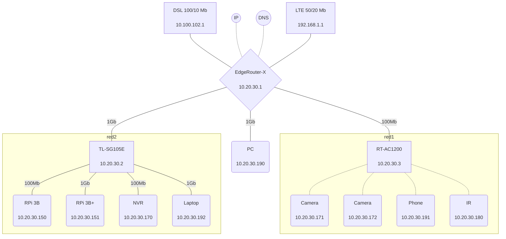

# Nginx 

Nginx is a web server that can also be used as a reverse proxy, load balancer, mail proxy and HTTP cache. A web server is computer software and underlying hardware that accepts requests via HTTP (the network protocol created to distribute web content) or its secure variant HTTPS. [[1]](https://en.wikipedia.org/wiki/Nginx)[[2]](https://en.wikipedia.org/wiki/Web_server)

Nginx is a high-performance, open-source web server, reverse proxy server, and load balancer. It is known for its speed, efficiency, and ability to handle concurrent connections. Nginx is commonly used to serve web content, handle reverse proxying, and perform load balancing for HTTP, HTTPS, and other protocols.

*Live network diagram ( InfluxDB + Grafana + Mermaid )* [[1]](https://community.home-assistant.io/t/live-network-diagram-influxdb-grafana-mermaid/100956) [[2]](https://github.com/mermaid-js/mermaid/issues/1227)

## OpenResty

OpenResty is an nginx distribution which includes the LuaJIT interpreter for Lua scripts. The software was created by Yichun Zhang. It was originally sponsored by Taobao before 2011 and was mainly supported by Cloudflare from 2012 to 2016. Since 2017, it has been mainly supported by OpenResty Software Foundation and OpenResty Inc. [[1]](https://en.wikipedia.org/wiki/OpenResty)

### Cloudflare
Cloudflare, Inc. is an American company that provides content delivery network services, cloud cybersecurity, DDoS mitigation, Domain Name Service, and ICANN-accredited domain registration services. Cloudflare's headquarters are in San Francisco, California. [[1]](https://en.wikipedia.org/wiki/Cloudflare)

## Comparisons
### Is Tomcat better than Nginx?

Tomcat and Nginx are both popular and widely used web server technologies, but they serve different purposes and have different strengths depending on the context in which they are used.

1. **Tomcat**:
   - Apache Tomcat is an open-source implementation of the Java Servlet, JavaServer Pages, Java Expression Language, and Java WebSocket technologies. It is primarily used as a web server and Java servlet container for deploying Java-based web applications. Tomcat is well-suited for running Java applications and providing support for Java servlets and JavaServer Pages (JSPs).

2. **Nginx**:
   - Nginx is a high-performance, open-source web server, and reverse proxy server. It is known for its speed, reliability, and scalability. Nginx is often used as a web server, load balancer, and reverse proxy for HTTP, HTTPS, and other protocols. It is highly efficient in handling concurrent connections and is commonly used as a front-end proxy for various applications.

The choice between Tomcat and Nginx depends on the specific use case and requirements of the application. If you are primarily working with Java-based web applications, then Tomcat is the more appropriate choice. On the other hand, if you need a high-performance web server or a reverse proxy for various applications, Nginx is a better option.

In some cases, both Tomcat and Nginx can be used together in a complementary manner, with Nginx serving as a front-end proxy to handle load balancing and static content delivery, while Tomcat manages the dynamic Java-based web application content. This setup can provide a robust and efficient solution for serving web applications with both static and dynamic content.

## Videos
 * [Let&#39;s install Docker + Portainer + NGINX Proxy Manager on Oracle Cloud – Oracle Linux 7.9](https://www.youtube.com/watch?v=Pnv4dK7zf94)
	> 
 * [Vamos instalar Docker + Portainer + NGINX Proxy Manager no Oracle Cloud – Oracle Linux 7.9](https://www.youtube.com/watch?v=gqoJfy8U0YE)
	> 
 * [Apache vs NGINX by IBM Technology](https://www.youtube.com/watch?v=9nyiY-psbMs)
	> 
 * [What is Nginx?](https://www.youtube.com/watch?v=b_B1BEShfBc)
	> 
 * [NGINX (O Servidor Web pensado em Performance e Escala) // Dicionário do Programador](https://www.youtube.com/watch?v=YXLI5Rbu_Ek)
	>  // Dicionário do Programador by Código Fonte TV 34,664 views 10 minutes, 4 seconds")
 * [Most Popular Web Servers 1993 - 2024) // Dicionário do Programador](https://www.youtube.com/watch?v=xCflmMmcsAk)
	> 
	
## References
1. https://openresty.org/en/
2. https://nginx.org/en/
3. [NGINX with Docker and Node.js — a Beginner’s guide](https://ashwin9798.medium.com/nginx-with-docker-and-node-js-a-beginners-guide-434fe1216b6b)
4. 