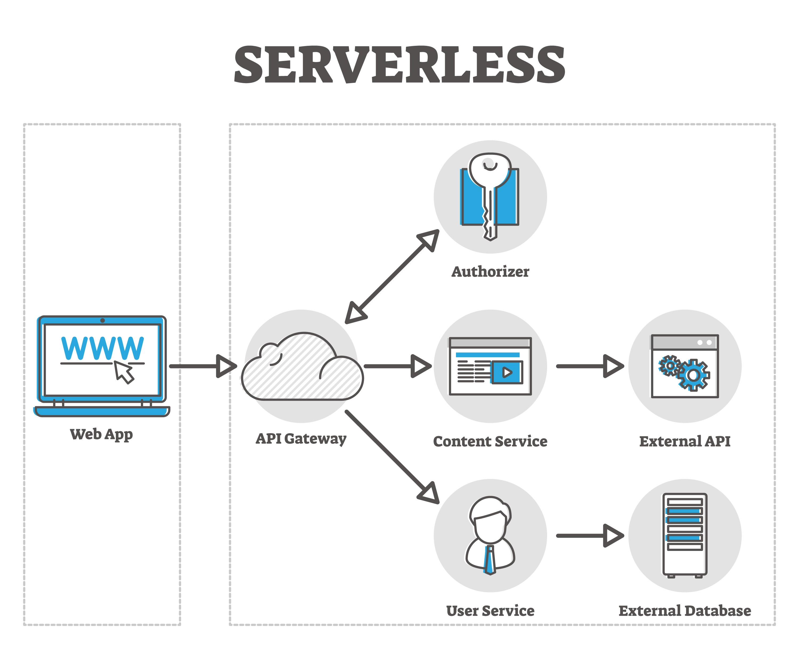

# 🛠️ Platform Engineering & DevOps Playbook

This repository is a comprehensive guide to building, deploying, and securing modern distributed systems.

## 🗺️ Knowledge Map

### 📐 [01_System_Design](./01_System_Design_and_Theory)

*The "Architect's Office." High-level patterns and interview prep. Architectural blueprints and mental models. From C4 diagrams to industry-standard engineering blogs.*

### ☁️ [02_Infrastructure_and_Cloud](./02_Infrastructure_and_Containers)

*The "Engine Room." Compute, virtualization, and IaC. The backbone: Kubernetes, Docker, and Infrastructure as Code (Terraform/Ansible).*

### 🚀 [03_Dev_Process_and_Automation](./03_CI_CD_and_Automation)

*The "Assembly Line." Shipping code reliably. Automation workflows using Jenkins and GitOps patterns with ArgoCD.*

### 🛡️ [04_Security](./04_Security_and_Identity)

*The "Vault." Protecting the perimeter and the data. The security stack: OAuth2, JWT, and automated security scanning (SAST/DAST).*

### 🔄 [05_Orchestration_and_Streaming](./05_Messaging_and_Workflows)

*The "Nervous System." How services talk and state is managed. Event-driven architectures (Kafka) and complex workflow orchestration (Camunda/SAGA).*

### 📈 [06_Reliability](./06_Observability_and_Resilience)

*The "Dashboard." Keeping the lights on. SRE essentials: Observability, log management, and resilience strategies.*

---

## ⚡ Quick Access
- **New to the team?** [How to put a website online.md](./02_Infrastructure_and_Containers/How%20to%20put%20a%20website%20online.md)
- **Security Audit?** [SAST, DAST and SCA, integration process.md](./04_Security_and_Identity/Application_Security/SAST,%20DAST%20and%20SCA,%20integration%20process.md)
- **Scaling Service Communication?** [Kafka.md](./05_Messaging_and_Workflows/Kafka.md)
