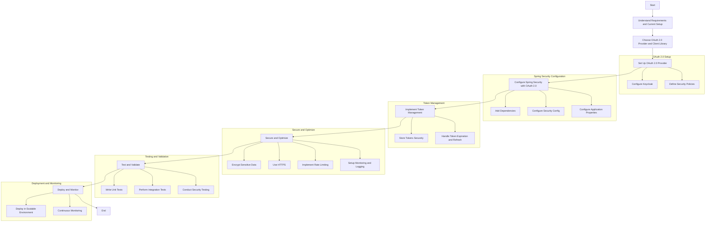
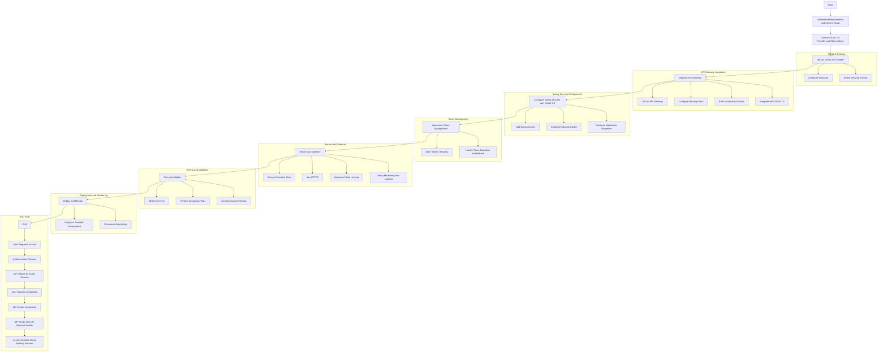

# OAuth 2.0

The choice of which OAuth 2.0 flow to use in your application depends on various factors, including the nature of your application, security requirements, and user experience considerations. Let's briefly discuss the suitability of each flow and when you might consider using them:

1. **Authorization Code Flow:** This is the most secure and recommended flow for server-side applications. It involves a two-step process where the client first obtains an authorization code and then exchanges it for an access token. It's suitable for applications that can securely store client secrets, such as web applications and server-to-server communication.

2. **Client Credentials Flow:** This flow is appropriate for confidential clients like server-to-server communication where there's no user involved. It directly returns an access token to the client. If your application is a backend service or a machine-to-machine communication, this flow might be suitable.

3. **Implicit Code Flow:** The Implicit Flow was widely used in the past for single-page applications (SPAs) running in web browsers. However, it's considered less secure now due to certain vulnerabilities like token leakage in the URL. Instead of Implicit Flow, it's recommended to use the Authorization Code Flow with PKCE (Proof Key for Code Exchange) for SPAs for better security.

4. **Resource Owner Password Grant Flow:** This flow allows users to provide their username and password directly to the client. It should generally be avoided unless you have specific requirements where the user's credentials are necessary and you can ensure their security. This flow is considered less secure and not recommended for most scenarios.

In summary, the choice of OAuth 2.0 flow depends on your application's architecture and security needs. For server-side applications, the Authorization Code Flow with PKCE is often the best choice. For confidential clients, the Client Credentials Flow is suitable. If you are developing a single-page application, consider the Authorization Code Flow with PKCE for better security. Avoid using the Resource Owner Password Grant Flow unless you have a compelling reason to do so, as it introduces security risks.

  > ### Uaa
  > The UAA is a multi tenant identity management service, used in Cloud Foundry, but also available as a stand alone OAuth2 server. Its primary role is as an OAuth2 provider, issuing tokens for client applications to use when they act on behalf of Cloud Foundry users. It can also authenticate users with their Cloud Foundry credentials, and can act as an SSO service using those credentials (or others). It has endpoints for managing user accounts and for registering OAuth2 clients, as well as various other management functions. https://github.com/cloudfoundry/uaa


## How would you approach designing and integrating an OAuth 2.0 SSO flow into an existing Spring Security framework, considering scalability and security best practices?




Integrating an OAuth 2.0 Single Sign-On (SSO) flow into an existing Spring Security framework, while considering scalability and security best practices, involves understanding the detailed SSO process and applying it to your application. Here's how you can design and integrate this process using a comprehensive approach:

#### 1. Understanding the Requirements and Current Setup
Before diving into implementation, understand the following:
- **Identify Stakeholders:** Determine the types of clients that will be using the SSO (web applications, mobile apps) and which systems need integration.
- **Analyze Current Security Configuration:** Review the existing Spring Security setup and identify points of integration.
- **Determine OAuth 2.0 Provider:** Choose the OAuth 2.0 provider you will integrate with (e.g., corporate identity like Keycloak, Apigee or external like Google, LinkedIn) based on project requirements and previous experience. Keycloak is a strong choice due to its robust support for OAuth 2.0 and customization options.
- **Determine The Data Required:** Define the user data required from the OAuth 2.0 provider (IdP) depends on the application's needs and the information available from the IdP (e.g., Common User Data Elements like ID Token and Access Token, UserInfo Endpoint Data like address and phone_number).

#### 2. Set Up OAuth 2.0 Provider
- **Configure Provider:** Set up Keycloak with appropriate realms, clients, and user roles. Ensure proper client credentials are in place.
- **Security Policies:** Define security policies, token lifetimes, and scopes within the OAuth 2.0 provider.

#### 3. Integrate API Gateway and Scalability Considerations

To ensure scalability:
- **Stateless Sessions:** Use stateless sessions (JWT tokens) to avoid session replication across servers.
- **Load Balancing:** Ensure your authentication server and resource servers are behind a load balancer.
- **Caching:** Use caching for user sessions and tokens where appropriate to reduce database load.
- **Set Up API Gateway:** Deploy an API Gateway (e.g., Apigee, AWS API Gateway) to handle incoming requests.
- **Configure Routing Rules:** Define routes to direct traffic to the appropriate microservices.
- **Enforce Security Policies:** Implement authentication and authorization at the gateway level.
- **Integrate with OAuth 2.0:** Ensure the gateway verifies OAuth 2.0 tokens before forwarding requests.

#### 4. Preparing the Spring Security Configuration with OAuth 2.0

Spring Security offers support for OAuth 2.0 via the `spring-security-oauth2-client` module. You need to ensure that your project is set up to include the necessary dependencies:

- **Dependencies:** Add necessary dependencies to your `pom.xml`.
```xml
<dependency>
    <groupId>org.springframework.boot</groupId>
    <artifactId>spring-boot-starter-oauth2-client</artifactId>
</dependency>
<dependency>
    <groupId>org.springframework.boot</groupId>
    <artifactId>spring-boot-starter-security</artifactId>
</dependency>
```
- **Configuration:** Configure Spring Security to use OAuth 2.0 for authentication. 

```java
import org.springframework.context.annotation.Configuration;
import org.springframework.security.config.annotation.web.builders.HttpSecurity;
import org.springframework.security.config.annotation.web.configuration.EnableWebSecurity;
import org.springframework.security.config.annotation.web.configuration.WebSecurityConfigurerAdapter;

@Configuration
@EnableWebSecurity
public class SecurityConfig extends WebSecurityConfigurerAdapter {

    @Override
    protected void configure(HttpSecurity http) throws Exception {
        http
            .authorizeRequests(authorizeRequests ->
                authorizeRequests
                    .antMatchers("/public/**").permitAll()
                    .anyRequest().authenticated()
            )
            .oauth2Login()
            .and()
            .oauth2Client();
    }
}
```

- **Application Properties:** Configure your application properties to connect to the OAuth 2.0 provider (Keycloak).

```properties
spring.security.oauth2.client.registration.keycloak.client-id=your-client-id
spring.security.oauth2.client.registration.keycloak.client-secret=your-client-secret
spring.security.oauth2.client.registration.keycloak.scope=openid,profile,email
spring.security.oauth2.client.provider.keycloak.authorization-uri=http://your-keycloak-server/auth/realms/your-realm/protocol/openid-connect/auth
spring.security.oauth2.client.provider.keycloak.token-uri=http://your-keycloak-server/auth/realms/your-realm/protocol/openid-connect/token
spring.security.oauth2.client.provider.keycloak.user-info-uri=http://your-keycloak-server/auth/realms/your-realm/protocol/openid-connect/userinfo
spring.security.oauth2.client.provider.keycloak.jwk-set-uri=http://your-keycloak-server/auth/realms/your-realm/protocol/openid-connect/certs
```

- **Configuration in `application.yml`:** You need to configure your application to use OAuth 2.0 providers. This involves setting up the client ID, client secret, and endpoints provided by the OAuth 2.0 provider.

```yaml
spring:
  security:
    oauth2:
      client:
        registration:
          google:
            client-id: your-client-id
            client-secret: your-client-secret
            scope: profile, email
            redirect-uri: "{baseUrl}/login/oauth2/code/{registrationId}"
            authorization-grant-type: authorization_code
            client-name: Google
        provider:
          google:
            authorization-uri: https://accounts.google.com/o/oauth2/auth
            token-uri: https://oauth2.googleapis.com/token
            user-info-uri: https://www.googleapis.com/oauth2/v3/userinfo
            user-name-attribute: sub
```
- **Customizing OAuth2UserService :** If you need to customize the retrieval of user information or handle additional user attributes, you can provide a custom `OAuth2UserService`.

```java
@Service
public class CustomOAuth2UserService extends DefaultOAuth2UserService {

    @Override
    public OAuth2User loadUser(OAuth2UserRequest userRequest) throws OAuth2AuthenticationException {
        OAuth2User oAuth2User = super.loadUser(userRequest);
        // Custom logic here
        return oAuth2User;
    }
}
```

#### 5. Implement Token Management
- **Token Storage:** Use a secure and scalable mechanism for storing tokens, such as an in-memory cache (e.g., Redis) or a database.
- **Token Renewal:** Implement logic to handle token expiration and refresh tokens automatically.

#### 6. Security Best Practices and Optimize
To ensure security:
- **Encrypt Sensitive Data:** Ensure that sensitive data, such as client secrets, are encrypted and stored securely.
- **Use HTTPS:** Ensure all communication between your app and the OAuth provider happens over HTTPS.Always use HTTPS to protect data in transit.
- **Rate Limiting:** Implement rate limiting to protect against abuse.
- **Scope Limitation:** Request only the scopes necessary for your application.
- **Token Validation:** Validate tokens on every request to ensure they haven't been tampered with.
- **Monitoring and Logging:** Set up monitoring and logging for security events, token usage, and access patterns.

#### 7. Test and Validate
Thoroughly test the integration, considering:
- **Unit Tests:** Write unit tests for authentication and authorization logic.
- **Integration Tests:** Ensure end-to-end tests are in place to validate the OAuth 2.0 flow.
- **Security Testing:** Perform penetration testing to identify potential vulnerabilities.

#### 8. Deploy and Monitor
- **Scalable Deployment:** Deploy the application in a scalable environment (e.g., Kubernetes) to handle increased load.
- **Continuous Monitoring:** Continuously monitor the application for security incidents and performance issues.
- **Logging:** Implement logging to track for authentication attempts, token issuance / validation, error rates and performance metrics.

By following these steps, you can integrate OAuth 2.0 SSO into your Spring Security framework in a scalable and secure manner.

## Videos
 * [OAuth 2 // Dicionário do Programador](https://www.youtube.com/watch?v=z-RuvnMlw34)
	> [](https://www.youtube.com/watch?v=z-RuvnMlw34 "OAuth 2 // Dicionário do Programador by Código Fonte TV 55,797 views 9 minutes, 2 seconds")
 * [Integración Spring Boot 3, Keycloak, Oauth2: Lleva la seguridad a otro nivel](https://www.youtube.com/watch?v=zR3igUft1KA)
	> [](https://www.youtube.com/watch?v=zR3igUft1KA "Integración Spring Boot 3, Keycloak, Oauth2: Lleva la seguridad a otro nivel by Un Programador Nace 11,115 views 2 hours, 40 minutes")
 * [Securing Spring Boot Microservices with Keycloak using OpenID | OAuth2.0 | JavaTechie](https://www.youtube.com/watch?v=La082JsJoH4)
	> [](https://www.youtube.com/watch?v=La082JsJoH4 "Securing Spring Boot Microservices with Keycloak using OpenID | OAuth2.0 | JavaTechie by Java Techie 111,098 views 32 minutes")
 * [Spring Boot 3 Keycloak OAuth 2 Tutorial with Spring Security](https://www.youtube.com/watch?v=_0oXZKr97ro)
	> [](https://www.youtube.com/watch?v=_0oXZKr97ro "Spring Boot 3 Keycloak OAuth 2 Tutorial with Spring Security by Programming Techie 20,919 views 1 hour, 5 minutes")
 * [Part 7.1 - Spring boot authentication process using oauth2 resource server and Keycloak](https://www.youtube.com/watch?v=32r_oZuwQxc)
	> [](https://www.youtube.com/watch?v=32r_oZuwQxc "Part 7.1 - Spring boot authentication process using oauth2 resource server and Keycloak by Dive Into Development 5,809 views 7 minutes, 3 seconds")


## References

1.

Integrating an OAuth 2.0 Single Sign-On (SSO) flow into an existing Spring Security framework, while considering scalability and security best practices, involves understanding the detailed SSO process and applying it to your application. Here's how you can design and integrate this process using a comprehensive plan and visualize it with a mermaid diagram.

### Comprehensive Plan

#### 1. Understand Requirements and Current Setup
- **Identify Stakeholders:** Determine who will use the SSO and which systems need integration.
- **Analyze Current Security Configuration:** Review the existing Spring Security setup and identify points of integration.
- **Determine OAuth 2.0 Provider:** Choose the OAuth 2.0 provider (e.g., Keycloak, Apigee) based on project requirements and previous experience.

#### 2. Choose OAuth 2.0 Provider and Client Library
- **OAuth 2.0 Provider:** Keycloak is a strong choice due to its robust support for OAuth 2.0 and customization options.
- **Client Library:** Use Spring Security OAuth 2.0 Client or Spring Boot's built-in support for OAuth 2.0.

#### 3. Set Up OAuth 2.0 Provider
- **Configure Provider:** Set up Keycloak with appropriate realms, clients, and user roles. Ensure proper client credentials are in place.
- **Security Policies:** Define security policies, token lifetimes, and scopes within the OAuth 2.0 provider.

#### 4. Integrate API Gateway
- **Set Up API Gateway:** Deploy an API Gateway (e.g., Apigee, AWS API Gateway) to handle incoming requests.
- **Configure Routing Rules:** Define routes to direct traffic to the appropriate microservices.
- **Enforce Security Policies:** Implement authentication and authorization at the gateway level.
- **Integrate with OAuth 2.0:** Ensure the gateway verifies OAuth 2.0 tokens before forwarding requests.

#### 5. Configure Spring Security with OAuth 2.0
- **Dependencies:** Add necessary dependencies to your `pom.xml`.

```xml
<dependency>
    <groupId>org.springframework.boot</groupId>
    <artifactId>spring-boot-starter-oauth2-client</artifactId>
</dependency>
<dependency>
    <groupId>org.springframework.boot</groupId>
    <artifactId>spring-boot-starter-security</artifactId>
</dependency>
```
- **Configuration:** Configure Spring Security to use OAuth 2.0 for authentication.

```java
import org.springframework.context.annotation.Configuration;
import org.springframework.security.config.annotation.web.builders.HttpSecurity;
import org.springframework.security.config.annotation.web.configuration.EnableWebSecurity;
import org.springframework.security.config.annotation.web.configuration.WebSecurityConfigurerAdapter;

@Configuration
@EnableWebSecurity
public class SecurityConfig extends WebSecurityConfigurerAdapter {

    @Override
    protected void configure(HttpSecurity http) throws Exception {
        http
            .authorizeRequests(authorizeRequests ->
                authorizeRequests
                    .antMatchers("/public/**").permitAll()
                    .anyRequest().authenticated()
            )
            .oauth2Login()
            .and()
            .oauth2Client();
    }
}
```
- **Application Properties:** Configure your application properties to connect to the OAuth 2.0 provider (Keycloak).

```properties
spring.security.oauth2.client.registration.keycloak.client-id=your-client-id
spring.security.oauth2.client.registration.keycloak.client-secret=your-client-secret
spring.security.oauth2.client.registration.keycloak.scope=openid,profile,email
spring.security.oauth2.client.provider.keycloak.authorization-uri=http://your-keycloak-server/auth/realms/your-realm/protocol/openid-connect/auth
spring.security.oauth2.client.provider.keycloak.token-uri=http://your-keycloak-server/auth/realms/your-realm/protocol/openid-connect/token
spring.security.oauth2.client.provider.keycloak.user-info-uri=http://your-keycloak-server/auth/realms/your-realm/protocol/openid-connect/userinfo
spring.security.oauth2.client.provider.keycloak.jwk-set-uri=http://your-keycloak-server/auth/realms/your-realm/protocol/openid-connect/certs
```
- **Dependencies:** Add necessary dependencies to your `pom.xml`.
- **Configuration:** Configure Spring Security to use OAuth 2.0 for authentication.
- **Application Properties:** Configure your application properties to connect to the OAuth 2.0 provider (Keycloak).
#### 6. Implement Token Management
- **Token Storage:** Use a secure and scalable mechanism for storing tokens, such as an in-memory cache (e.g., Redis) or a database.
- **Token Renewal:** Implement logic to handle token expiration and refresh tokens automatically.

#### 7. Secure and Optimize
- **Encrypt Sensitive Data:** Ensure that sensitive data, such as client secrets, are encrypted and stored securely.
- **Use HTTPS:** Always use HTTPS to protect data in transit.
- **Rate Limiting:** Implement rate limiting to protect against abuse.
- **Monitoring and Logging:** Set up monitoring and logging for security events, token usage, and access patterns.

#### 8. Test and Validate
- **Unit Tests:** Write unit tests for authentication and authorization logic.
- **Integration Tests:** Ensure end-to-end tests are in place to validate the OAuth 2.0 flow.
- **Security Testing:** Perform penetration testing to identify potential vulnerabilities.

#### 9. Deploy and Monitor
- **Scalable Deployment:** Deploy the application in a scalable environment (e.g., Kubernetes) to handle increased load.
- **Continuous Monitoring:** Continuously monitor the application for security incidents and performance issues.

#### 10. SSO Flow
To fully understand the SSO process, let's incorporate the user flow you described.

### SSO Flow Explained
1. **User Requests Access:**
   - The user attempts to access the Service Provider (e.g., LinkedIn). They select "Sign in with Google".

2. **Authentication Request:**
   - The Service Provider redirects the user to the Identity Provider (Google) with an authentication request.

3. **IdP Checks for Active Session:**
   - The Identity Provider checks for an active session. If none is found, authentication is requested.

4. **User Submits Credentials:**
   - The user submits their credentials to the Identity Provider.

5. **IdP Verifies Credentials:**
   - The Identity Provider verifies the credentials against its User Directory.

6. **IdP Sends Token to Service Provider:**
   - The IdP creates an authentication token and sends it back to the Service Provider.

7. **Access Granted Using Existing Session:**
   - The user is now authenticated and can access the Service Provider. Future service providers will recognize the existing session and grant access without re-entering credentials.

### Mermaid Diagram



This diagram represents the comprehensive flow for integrating an OAuth 2.0 SSO into a Spring Security framework, highlighting each step, including the incorporation of an API Gateway and detailed SSO process.