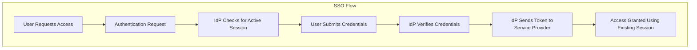

# SSO (Single Sign-On) explained.

SSO can be thought of as a master key to open all different locks. It allows a user to log in to different systems using a single set of credentials.

In a time where we are accessing more applications than ever before, this is a big help to mitigate password fatigue and streamlines user experience.

To fully understand the SSO process, let’s take a look at how a user would log into LinkedIn using Google as the identity provider:

1) User requests access

First, the user would attempt to access the Service Provider (LinkedIn). At this point, a user would be presented with login options, and in this example, they would select "Sign in with Google".

2) Authentication request

From here, the Service Provider (LinkedIn) will redirect the user to the Identity Provider (Google) with an authentication request.

3) IdP checks for active session

Once the Identity Provider (Google) has received the request, it will check for an active session. If it doesn't find one, authentication will be requested.

4) User submits credentials

At this stage, the user will submit their login credentials (username and password) to the Identity Provider (IdP).

5) IdP verifies credentials

The Identity Provider will then verify the submitted credentials against its User Directory (database). If the credentials are correct, the IdP will create an authentication token or assertion.

6) IdP sends token to Service Provider

Once the token or assertion has been created, the IdP sends it back to the Service Provider confirming the user's identity. The user is now authenticated and can access the Service Provier (LinkedIn).

7) Access granted using existing session

Since the Identity Provider has established a session, when the user goes to access a different Service Provider (eg; GitHub), they won't need to re-enter their credentials. Future service providers will request authentication from the Identity Provider, recognize the existing session, and grant access to the user based on the previously authenticated session.

SSO workflows like the above operate on SSO protocols, which are a set of rules that govern how the IdP and SP communicate and trust each other. Common protocols include Security Assertion Markup Language (SAML), OpenID Connect, and OAuth.

## What is SSO (Single Sign-On)?

Single Sign-On (SSO) is an authentication scheme that allows a user to log in to different systems using a single set of credentials. The diagram below illustrates how SSO works.

Step 1: A user visits Gmail. Gmail finds the user is not logged in and redirects them to the SSO authentication server, which also finds the user is not logged in. As a result, the user is redirected to the SSO login page, where they enter their login credentials.

Steps 2-3: The SSO authentication server validates the credentials, creates a session for the user, and creates a token.

Steps 4-7: Gmail sends the token to the SSO authentication server for validation. The authentication server registers the Gmail system and returns "valid." Gmail then returns the protected resource to the user.

Step 8: From Gmail, the user navigates to another Google-owned website, for example, YouTube.

Steps 9-10: YouTube finds the user is not logged in and sends the token to the SSO authentication server for validation. The SSO authentication server finds the user's session is already active and returns the token.

Steps 11-14: YouTube validates the token with the SSO authentication server. The authentication server registers the YouTube system and returns "valid." YouTube then returns the protected resource to the user. The process is complete, and the user gains access to their account without needing to log in again.

## References
1. https://www.linkedin.com/in/sahnlam/recent-activity/all/
2. 